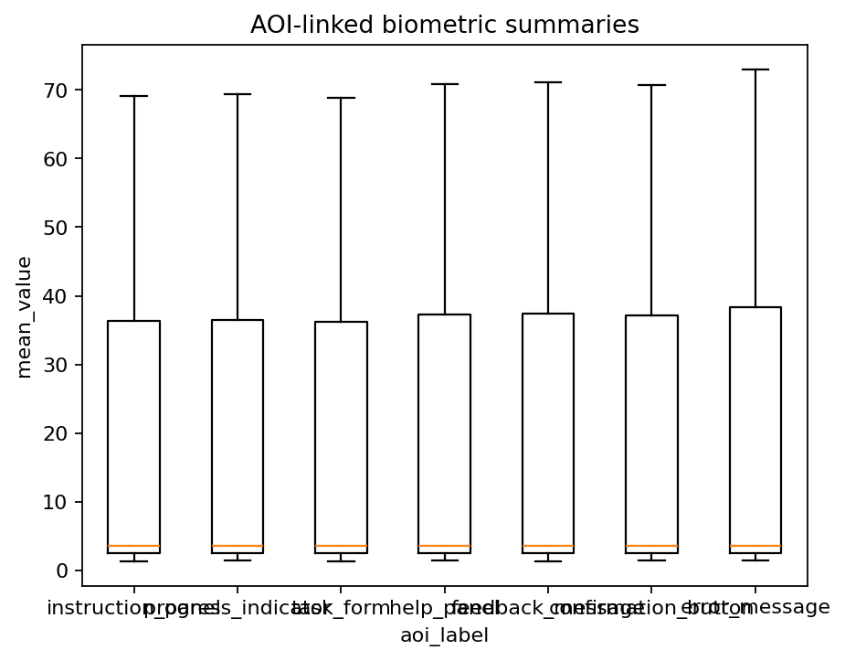
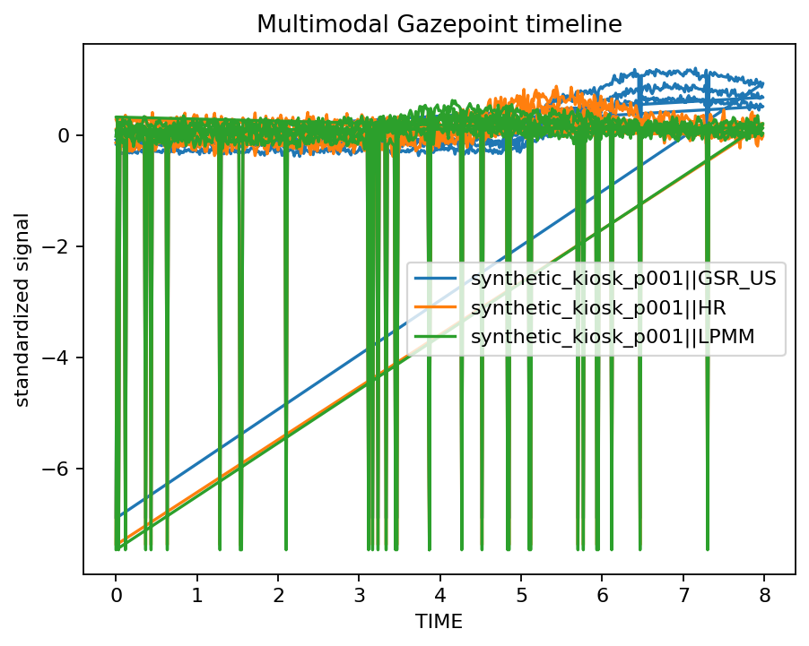

# Event alignment and AOI-linked biometric workflow

**Frozen R source:** `reference/vignettes/articles/event-alignment-aoi-workflow.Rmd`

This page is the Python migration companion for the corresponding `gpbiometrics 2.0.0` article. The original R article is retained verbatim in `reference/vignettes/`; this companion identifies the matching Python API so the scientific workflow can be reproduced without hiding the reference implementation.

## Python API crosswalk

The frozen R article calls the following exported functions; all are available under the same names in `gpbiometricspy`:

- `gp.align_gazepoint_biometrics_to_ttl(...)`
- `gp.align_gazepoint_streams_by_events(...)`
- `gp.assess_gazepoint_sampling_irregularity(...)`
- `gp.audit_gazepoint_biometric_sync_drift(...)`
- `gp.audit_gazepoint_event_coverage(...)`
- `gp.build_gazepoint_aoi_timecourse(...)`
- `gp.create_gazepoint_analysis_decision_log(...)`
- `gp.create_gazepoint_qc_supplement(...)`
- `gp.create_gazepoint_reproducibility_statement(...)`
- `gp.detect_gazepoint_biometric_timebase(...)`
- `gp.diagnose_gazepoint_sync_drift(...)`
- `gp.extract_gazepoint_ttl_events(...)`
- `gp.join_gazepoint_biometrics_to_gp3tools(...)`
- `gp.join_gazepoint_biometrics_to_master(...)`
- `gp.match_gazepoint_events_to_biometrics(...)`
- `gp.plot_gazepoint_multimodal_timeline(...)`
- `gp.prepare_gazepoint_aoi_biometrics_model_data(...)`
- `gp.prepare_gazepoint_multimodal_model_data(...)`
- `gp.simulate_gazepoint_biometrics(...)`
- `gp.simulate_gazepoint_eye_data(...)`
- `gp.standardise_gazepoint_biometric_names(...)`
- `gp.standardize_gazepoint_column_names(...)`
- `gp.summarise_gazepoint_aoi_biometrics(...)`
- `gp.summarise_gazepoint_multimodal_windows(...)`
- `gp.summarize_gazepoint_eventlocked_multimodal(...)`
- `gp.sync_gazepoint_biometrics_with_gaze(...)`
- `gp.validate_gazepoint_biometrics(...)`
- `gp.validate_gazepoint_format(...)`
- `gp.validate_gazepoint_metadata(...)`

```python
import gpbiometricspy as gp

# Example entry point from this workflow
# result = gp.align_gazepoint_biometrics_to_ttl(...)
```

## Interpretation

Use the same conservative physiological interpretation as the R package: derived biometric features are signal-processing outputs and do not directly establish emotion, stress, cognition, preference, health status, or diagnosis.

## Executable Python companion

The frozen R call crosswalk above is retained for completeness. The following companion is an executable end-to-end Python workflow using synthetic/public data and the same scientific domain. It is also executed by the test suite.

Run from the repository root:

```bash
python examples/tutorials/event-alignment-aoi-workflow.py
```

```python
from __future__ import annotations
from _shared import *
d=demo(900); ttl=gp.extract_gazepoint_ttl_events(d,ttl_columns=['TTL0'],group_columns=['participant_id']); aligned=gp.align_gazepoint_biometrics_to_ttl(d,ttl_cols=['TTL0'],time_col='TIME',group_cols=['participant_id'],pre_window_ms=250,post_window_ms=500)
aoi=gp.summarize_gazepoint_aoi_dwell(d,aoi_col='AOI',group_cols=['participant_id']); finish('event-alignment-aoi-workflow',ttl=ttl,aligned=aligned,aoi=aoi)
```


## Rendered Python output

These figures are generated from bundled synthetic/public data by `scripts/generate_docs_gallery.py` using the current Python plotting API.

### AOI-linked biometrics



### Multimodal timeline


