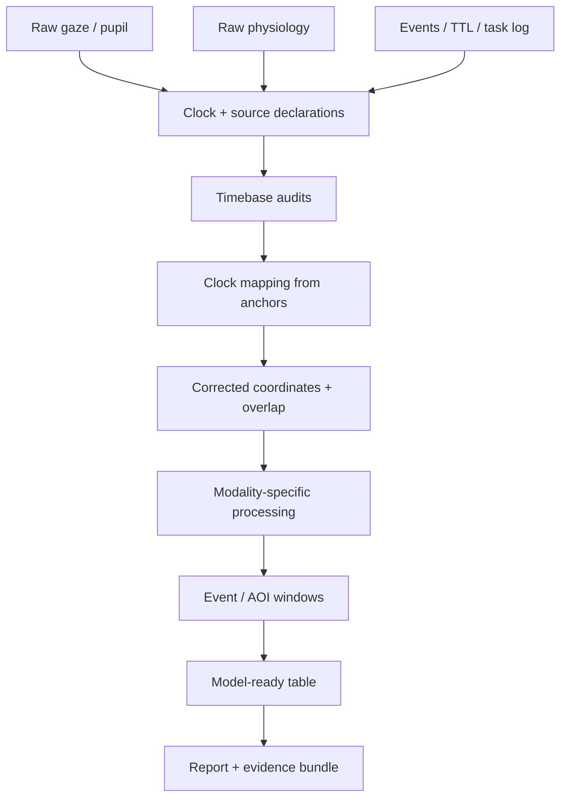

# Reproducible multimodal studies

> **Python-native explanation article.** This page explains the development-line architecture; it is not one of the 26 frozen R vignette companions.

Multimodal analysis becomes fragile when synchronization, preprocessing, event definitions, and feature construction are mixed into one script. A reproducible design keeps the clocks, signal transformations, and scientific units of analysis explicit from acquisition through reporting.

## A provenance-first structure

## Preserve native evidence before fusion

Each stream should retain its original timestamp or counter, nominal sampling information, observed timing audit, source identity, and preprocessing history. Creating a shared analysis grid too early can erase evidence about which stream contained gaps, resets, or irregular intervals.

## Treat anchors as measurements

Matched TTL edges, task markers, or other synchronization anchors have their own measurement precision. Record how anchors were paired, which were rejected, and the residuals after the chosen mapping. A fitted offset or affine relationship is only as strong as those anchors.

## Separate clock correction from signal interpolation

Correcting timestamps answers “where does this observation sit in the reference clock?” Interpolation answers “what value should be represented at a new time coordinate?” These are different questions with different assumptions.

A conservative workflow can therefore retain:

- original time;
- corrected time;
- mapping parameters;
- anchor residuals;
- overlap bounds;
- target resampling grid;
- interpolation method;
- interpolation burden or missingness after resampling.

## Define the analysis unit after timing is defensible

Event windows, AOI-linked physiology, trial summaries, and multimodal feature tables should be constructed only after the relevant streams have a defensible temporal relation. Otherwise a precise-looking window can conceal uncertain alignment.

## Model the design you actually have

Multimodal studies commonly contain repeated trials, participants, stimuli/items, and several derived signals. The modelling stage should reflect those units rather than treating every row as independent.

When the scientific question includes participant and item heterogeneity, the crossed location–scale family provides an explicit alternative to collapsing one factor into fixed summaries. When the target is prediction to unseen participants, use whole-group validation rather than row-wise splits.

## Report uncertainty at the layer where it arises

Not every uncertainty belongs in the final statistical standard error. Examples:

- timing uncertainty belongs in the synchronization evidence;
- signal-quality uncertainty belongs in QC and sensitivity analysis;
- interval-source uncertainty belongs in cardiac provenance;
- item/participant heterogeneity belongs in the model structure;
- software/backend uncertainty belongs in versioned interoperability evidence.

This separation makes it easier to see which claims are sensitive to which assumptions.

## Practical resources

- [Multimodal example](../../examples/multimodal.md)
- [Timebase and alignment guide](../../guides/timebase-alignment.md)
- [Timebase provenance method](../../methods/timebase-provenance.md)
- [MNE, EEG and LSL workflow](../mne-eeg-lsl-workflow.md)
- [Multimodal event dashboard](../multimodal-event-dashboard.md)
- [Reporting and reproducibility guide](../../guides/reporting-reproducibility.md)

Temporal alignment can support defensible event locking and multimodal fusion. It does not by itself establish causal order, sensor validity, or psychological meaning of the recorded signals.

