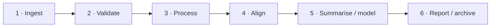

# Research pipeline blueprint

> **Python-native explanation article.** This page explains the development-line architecture; it is not one of the 26 frozen R vignette companions.

A robust psychophysiology or eye-tracking workflow is easier to audit when each layer answers a different question. `gpbiometricspy` therefore separates **measurement evidence**, **signal transformation**, **alignment**, **feature construction**, **modelling**, and **reporting** rather than hiding them inside a single opaque pipeline.

## Six layers

### 1. Ingest: what was actually recorded?

The first layer establishes file identity, schema, units, grouping variables, and channel provenance. A column name is not sufficient evidence of scientific identity: an `HR` series is not automatically a beat-to-beat interval series, and a timestamp is not automatically a shared clock.

### 2. Validate: what can the recording support?

Validation asks whether the data have the timing, coverage, source identity, and signal quality required for the intended analysis. This includes missingness, resets, duplicates, event coverage, observed sampling behavior, PPG/interval provenance, pupil/gaze validity, and design balance.

A failed validation check is not merely a software inconvenience. It may narrow the scientific question that the dataset can answer.

### 3. Process: what transformation was applied?

Filtering, decomposition, peak detection, interpolation, baseline correction, AOI mapping, and feature construction should be parameterized and visible. The transformed output should remain traceable to the raw or standardized input.

### 4. Align: what does simultaneity mean here?

Multimodal alignment requires an explicit relation between clock domains. Offset/drift correction should be based on recorded timing evidence or matched anchors, with residuals and overlap retained. Clock correction is distinct from interpolation onto a common grid.

### 5. Summarise or model: what is the target?

The appropriate unit of validation depends on the target. New-group prediction requires whole-group holdout; crossed participant–item analyses require explicit semantics for unseen participants and unseen items. Distributional models of residual scale answer a different question from signal QC.

### 6. Report and archive: can another researcher reconstruct the decision path?

The output of a reproducible workflow is not just a final table. It includes QC, settings, plots, software identity, warnings, exclusions, timing evidence, model certificates where available, and the scientific interpretation boundaries used in the paper.

## Why the layers should not collapse

Collapsing stages creates category errors. Examples include:

- treating a small alignment residual as proof of hardware synchronization;
- treating a residual-scale random effect as a sensor-quality score;
- treating a PPG-derived interval metric as interchangeable with ECG NN-HRV;
- treating row-wise validation as evidence of new-participant generalisation;
- treating a predictive feature importance as a causal effect;
- treating successful preprocessing as evidence that the original measurement was valid.

## A practical evidence contract

Before each downstream step, state what upstream evidence it assumes.

| Downstream operation | Evidence it depends on |
|---|---|
| Event-locked averaging | trustworthy event identity and timebase relation |
| HRV metrics | defensible beat/interval source and cleaning semantics |
| Pupil baseline correction | valid pupil samples and a justified baseline window |
| AOI-linked physiology | AOI definition, gaze validity, event timing, signal timing |
| Cluster permutation | complete design grid and justified exchangeability structure |
| Group-held-out prediction | grouping variable matches the intended generalisation unit |
| Crossed location–scale model | connected participant–item incidence and adequate replication |

## What this architecture buys you

It makes failure local. If a timebase audit fails, you do not need to distrust unrelated API functions; you need to stop claims that require unsupported timing precision. If an item factor is too sparse for a crossed slope, a simpler model can remain valid. If a vendor metric has unclear provenance, it can remain metric-only without being relabelled as a raw physiological series.

This is the design logic behind the [Workflow map](../../workflows.md), [Validation guide](../../guides/validate-dataset.md), [Methods](../../methods/index.md), and [Reporting guide](../../guides/reporting-reproducibility.md).
