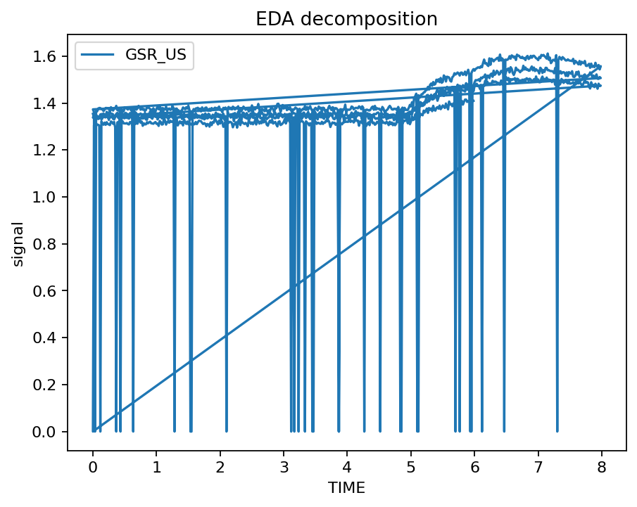
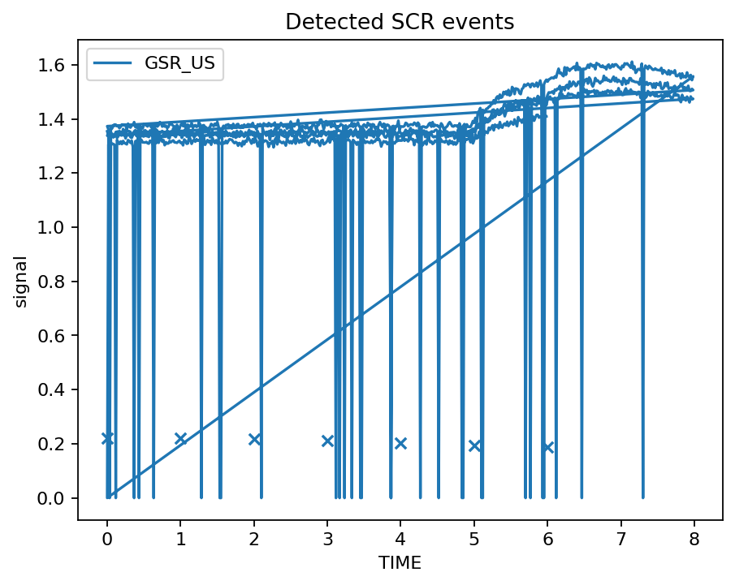
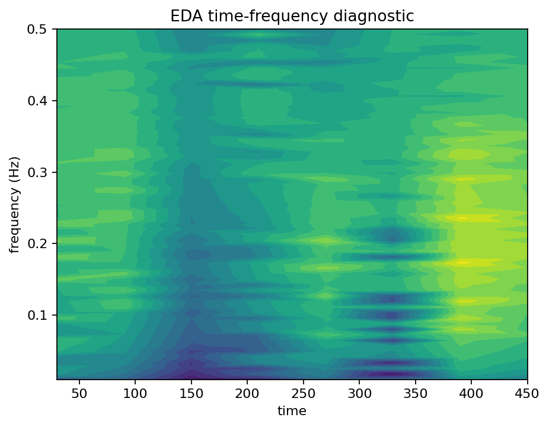

# EDA, GSR and SCR example

Load a deterministic slice of the bundled kiosk demonstration, inspect electrodermal quality, decompose the signal, detect candidate SCR events, and plot the result.

```python
import gpbiometricspy as gp

dat = gp.load_kiosk_demo(participants=["synthetic_kiosk_p001"]).iloc[:1800].copy()

quality = gp.audit_gazepoint_gsr_quality(dat, value_column="GSR_US")

decomposition = gp.decompose_gazepoint_eda(
    dat,
    signal_col="GSR_US",
    time_col="TIME",
    group_cols=["participant_id"],
    window_size=31,
)

events = gp.detect_gazepoint_scr_events(
    decomposition,
    phasic_col="eda_phasic",
    time_col="TIME",
    group_cols=["participant_id"],
    min_peak_distance=10,
)
```

## Rendered outputs







The package deliberately reports signal-processing outputs rather than inferring emotion, stress, preference, diagnosis or other latent states from EDA alone.

See also [EDA and SCR visual diagnostics](../articles/eda-scr-visual-diagnostics.md).
