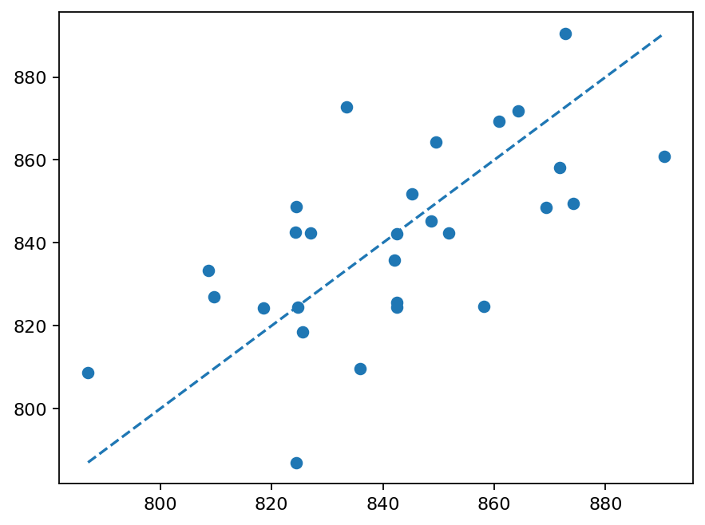
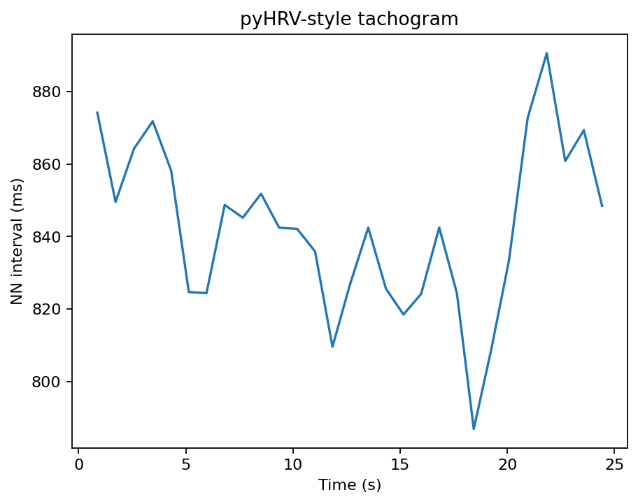

# PPG and HRV example

The core PPG family can detect pulse peaks, reject implausible intervals, calculate summary measures and generate standard HRV diagnostics.

```python
import gpbiometricspy as gp

sim = gp.simulate_gazepoint_biometrics(
    n_seconds=30,
    sampling_rate=60,
    seed=42,
)["data"]

peaks = gp.detect_gazepoint_ppg_peaks(
    sim,
    signal_col="HRP",
    time_col="CNT",
    group_cols=["participant_id"],
    sampling_rate_hz=60,
)

fig = gp.plot_gazepoint_ppg_peak_detection(peaks)
```

## Rendered outputs






See also [PPG and HRV visual diagnostics](../articles/ppg-hrv-visual-diagnostics.md) and the [PPG, IBI, HRV and respiration workflow](../articles/ppg-hrv-workflow.md).
