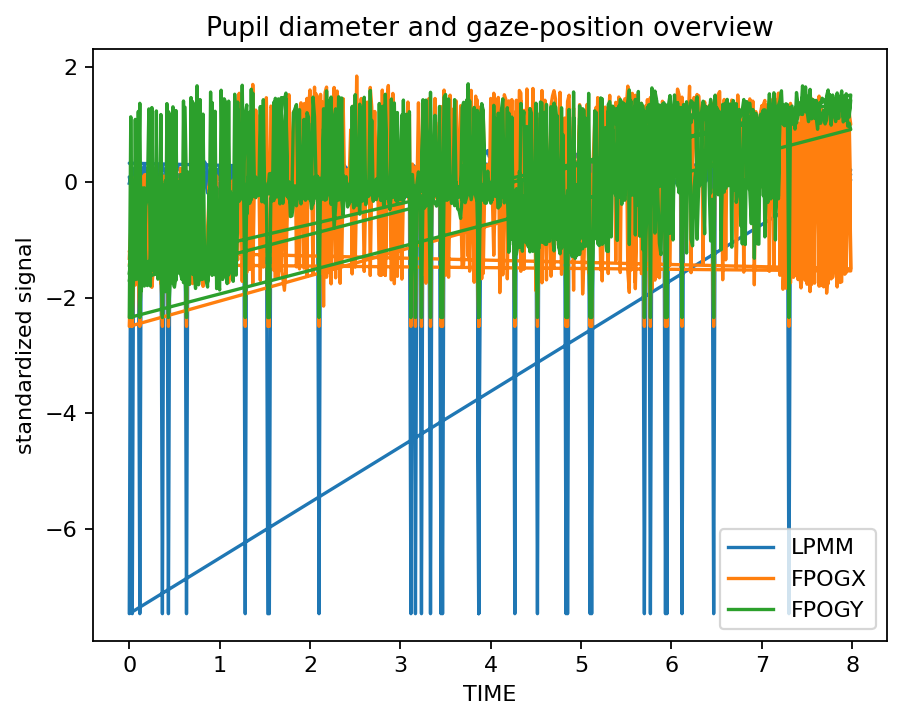
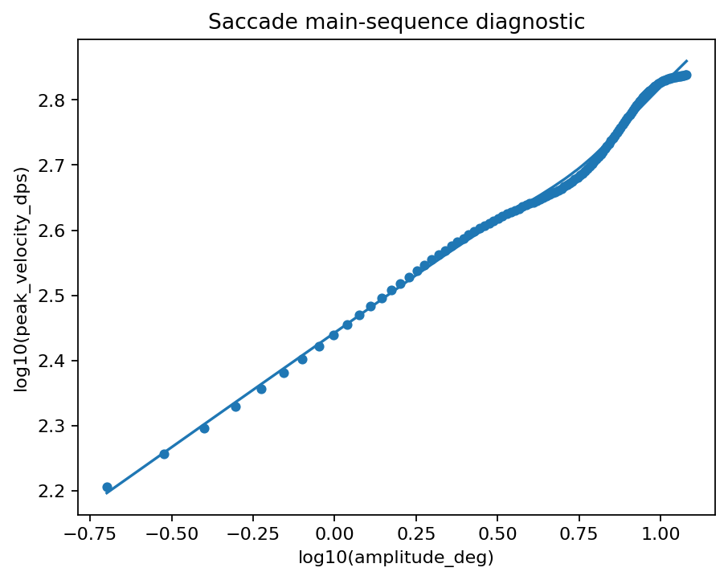

# Pupil, gaze and AOI example

`gpbiometricspy` keeps pupil, gaze and physiology in the same workflow so quality control and event/AOI summaries can be performed without switching data models.

```python
import gpbiometricspy as gp

dat = gp.load_kiosk_demo(participants=["synthetic_kiosk_p001"]).iloc[:1800].copy()

aoi = gp.summarise_gazepoint_aoi_biometrics(
    dat,
    aoi_col="AOI",
    signal_cols=["GSR_US", "HR", "LPMM"],
    group_cols=["participant_id"],
)

fig = gp.plot_gazepoint_aoi_biometrics(
    aoi["summary"],
    value_col="mean_value",
    aoi_col="aoi_label",
    signal_col="signal",
)
```

## Rendered outputs






See also [Pupil and gaze QC](../articles/pupil-qc-workflow.md) and [Event alignment and AOI-linked biometrics](../articles/event-alignment-aoi-workflow.md).
