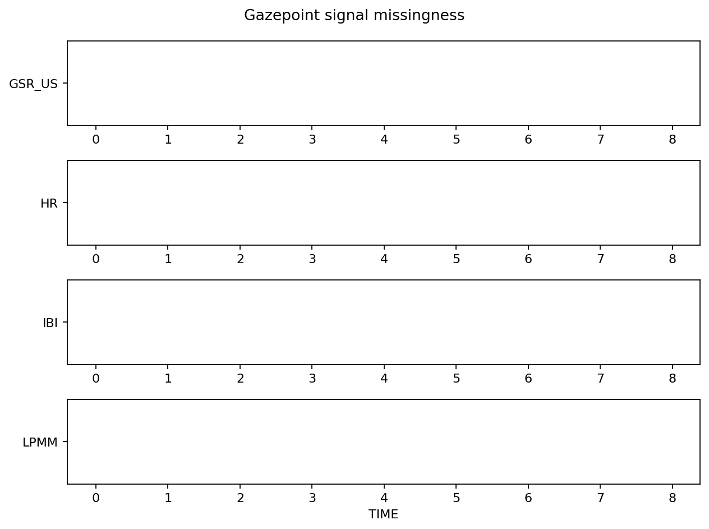
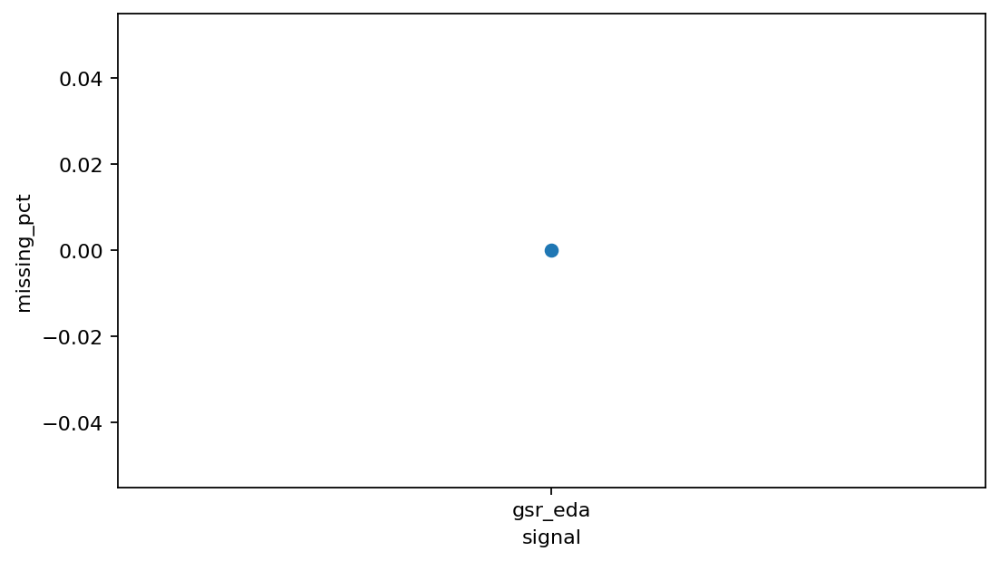

# Quality control and reporting example

Quality control is intended to be visible and auditable rather than hidden inside preprocessing.

```python
import gpbiometricspy as gp

dat = gp.load_kiosk_demo(participants=["synthetic_kiosk_p001"]).iloc[:1800].copy()

gsr_quality = gp.audit_gazepoint_gsr_quality(dat, value_column="GSR_US")
activity = gp.audit_gazepoint_signal_activity(
    dat,
    signal_cols=["GSR_US", "HR", "IBI", "LPMM"],
    group_cols=["participant_id"],
)
resets = gp.audit_gazepoint_time_resets(
    dat,
    time_col="TIME",
    group_cols=["participant_id"],
)
```

## Rendered outputs





The reporting family can combine these audits into publication-oriented tables, reproducibility records and QC dashboards. See [Visual QC dashboard workflow](../articles/visual-qc-dashboard-workflow.md) and [Reporting and reproducibility](../articles/reporting-reproducibility-workflow.md).
