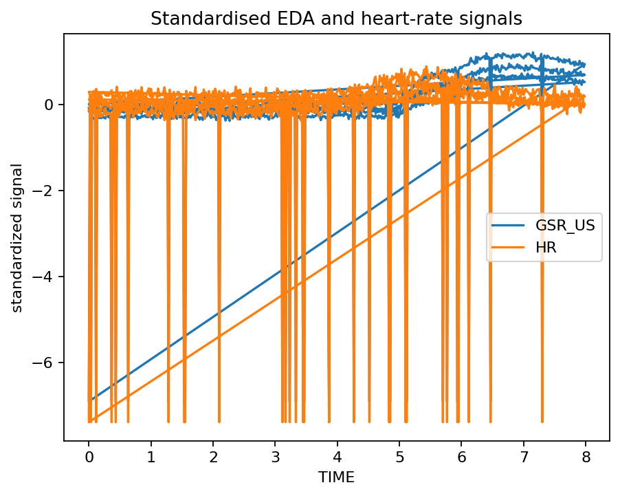

# First analysis

<div class="gp-page-intro">
This tutorial gives you one successful end-to-end path through `gpbiometricspy` using bundled synthetic/public demonstration data. The aim is to learn the workflow shape before introducing private research data or optional external toolboxes.
</div>

## 1. Install the stable package

```bash
python -m pip install "gpbiometricspy==0.1.6"
```

For the development line from a checked-out repository, install the editable package instead:

```bash
python -m pip install -e ".[dev,docs]"
```

## 2. Load a deterministic demonstration

```python
import gpbiometricspy as gp

print(gp.__version__)

dat = (
    gp.load_kiosk_demo(participants=["synthetic_kiosk_p001"])
    .copy()
    .iloc[:1800]
    .reset_index(drop=True)
)

print(dat.shape)
print(dat[["TIME", "GSR_US", "HR", "IBI", "LPMM", "FPOGX", "FPOGY"]].head())
```

The demonstration intentionally contains multiple modalities so you can practice a realistic QC-and-alignment sequence without uploading participant data.

## 3. Inspect the recorded channels

```python
signals = gp.plot_gazepoint_biometric_signals(
    dat,
    signal_cols=["GSR_US", "HR", "LPMM"],
    time_col="TIME",
    standardize=True,
    main="First-pass signal overview",
)
```



At this stage you are asking whether the channels exist, vary, and are temporally inspectable—not whether they support a substantive psychological interpretation.

## 4. Make QC explicit

```python
activity = gp.audit_gazepoint_signal_activity(
    dat,
    signal_cols=["GSR_US", "HR", "IBI", "LPMM"],
    group_cols=["participant_id"],
)

resets = gp.audit_gazepoint_time_resets(
    dat,
    time_col="TIME",
    group_cols=["participant_id"],
)

gsr_quality = gp.audit_gazepoint_gsr_quality(
    dat,
    value_column="GSR_US",
)
```

Useful visual checks include:

<div class="gp-visual-grid">
<a class="gp-visual-card" href="../plot-gallery/#signal-overview-and-quality">

<div class="gp-visual-card-body"><strong>Missingness</strong><span>Check channel availability before deriving features.</span></div>
</a>
<a class="gp-visual-card" href="../plot-gallery/#signal-overview-and-quality">

<div class="gp-visual-card-body"><strong>Signal quality</strong><span>Retain explicit QC evidence rather than hiding it inside preprocessing.</span></div>
</a>
</div>

## 5. Follow one modality into analysis

For EDA/SCR:

```python
scr = gp.detect_gazepoint_scr_events(
    dat,
    phasic_col="GSR_US_PHASIC",
    signal_col="GSR_US",
    time_col="TIME",
    group_cols=["participant_id"],
    threshold=0.02,
    min_peak_distance=30,
)

scr_plot = gp.plot_gazepoint_scr_events(
    dat,
    scr["events"],
    time_col="TIME",
    signal_col="GSR_US",
    phasic_col="GSR_US_PHASIC",
    group_cols=["participant_id"],
)
```


You could instead branch into [PPG/HRV](../examples/ppg-hrv.md), [pupil/gaze/AOI](../examples/pupil-gaze.md), or [multimodal alignment](../examples/multimodal.md).

## 6. Retain a reproducible evidence bundle

A complete first analysis should leave behind at least:

- the package version;
- the input source and selected participant/session scope;
- the columns and timebase used;
- QC outputs and warnings;
- preprocessing or detection settings;
- generated figures used for inspection;
- derived tables or events;
- any exclusions or fail-closed decisions.

The [Reporting and reproducibility guide](reporting-reproducibility.md) expands this into a publication-oriented checklist.

## 7. Know when the tutorial is finished

You are ready to move to your own data when you can answer these questions without guessing:

- Which column is the analysis timebase?
- Which channels are raw, cleaned, derived, or vendor-precomputed?
- Which QC checks must pass before downstream analysis?
- Which grouping variables define participants, trials, items, or sessions?
- Which outputs are measurements, which are diagnostics, and which are model-derived quantities?
- Which scientific interpretations are *not* justified by the software output alone?

!!! success "Next step"
    Open [Validate a new dataset](validate-dataset.md) before replacing the demonstration data with a research export.
