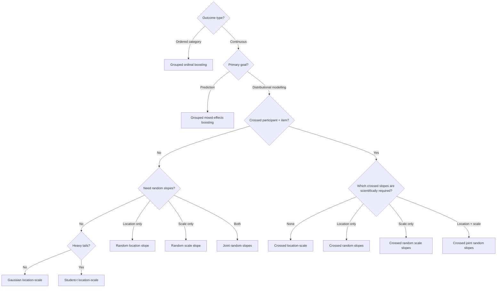

# Choose a modelling strategy

Use this guide to choose among the current Python-native modelling families. Start from the scientific target and grouping structure, not from the most complex model available.

## Fast chooser

| Research need | Start with | Why | Do not claim |
|---|---|---|---|
| Nonlinear prediction of a continuous repeated outcome with one grouping factor | [Grouped mixed-effects boosting](../methods/grouped-mixed-boosting.md) | Whole-group validation, shrinkage random intercepts, nonlinear fixed component | likelihood-based inference or causal importance |
| Prediction of an ordered categorical repeated outcome | [Grouped ordinal boosting](../methods/grouped-ordinal-boosting.md) | Ordered thresholds, ordinal losses, group-aware validation | latent traits, diagnosis, p-values |
| Model both mean and residual heterogeneity within one grouping factor | [Gaussian location–scale](../methods/hierarchical-location-scale.md) | Joint location/log-scale equations with correlated random intercepts | artifact or reliability scores from log-scale effects |
| Same, but outcome has symmetric heavy tails | [Robust Student-t location–scale](../methods/robust-hierarchical-location-scale.md) | Distributional robustness with finite-variance Student-t family | proof that specific observations are artifacts |
| Participant/group-specific slope in the mean equation | [Random location slope](../methods/random-slope-location-scale.md) | Mean heterogeneity in a declared numeric predictor | causal individual differences |
| Participant/group-specific slope in residual scale | [Random scale slope](../methods/random-scale-slope-location-scale.md) | Heterogeneity in the log-scale equation | sensor-validity or noise labels |
| Random slopes in both mean and scale equations | [Joint random slopes](../methods/joint-random-slopes-location-scale.md) | Full 4×4 covariance among location/scale intercepts and slopes | unrestricted general random-effects grammar |
| Participant and item/stimulus clustering | [Crossed location–scale](../methods/crossed-location-scale.md) | Separate participant/item random-intercept structures | nested-only interpretations |
| Participant and item-specific slopes in the mean equation | [Crossed random slopes](../methods/crossed-random-slopes-location-scale.md) | Crossed location slopes with joint Laplace integration | log-scale random-slope interpretation |
| Participant and item-specific slopes in residual scale | [Crossed random scale slopes](../methods/crossed-random-scale-slopes-location-scale.md) | Crossed log-scale slopes with joint Laplace integration | artifact, reliability or sensor-validity scores |
| Participant and item-specific slopes in both equations | [Crossed joint random slopes](../methods/crossed-joint-random-slopes-location-scale.md) | Separate 4×4 participant/item covariance blocks with explicit conditional/population prediction | causal random-slope effects or a general random-effects grammar |

## Decision path

## Choose the validation unit before the model

If the scientific question concerns generalisation to **new participants or groups**, validate by holding out whole groups. Row-wise splits leak group-specific information and estimate a different target.

For crossed participant–item models, be explicit about whether prediction targets:

- observed participants and observed items;
- new participants with known items;
- known participants with new items;
- both new participants and new items.

Conditional and population predictions are not interchangeable.

## Random slopes require design support

A random slope is not justified merely because a predictor is numeric. The slope variable must vary within the relevant grouping level and appear in the corresponding fixed equation. For crossed models, the predictor must vary within every level of the factor receiving that random slope.

A scale-slope predictor must enter the fixed log-scale equation; a location-slope predictor must enter the fixed mean equation. The crossed joint model checks all four declarations independently and requires at least eight participant levels and eight item levels before estimating its 4×4 covariance blocks.

## When a simpler model is better

Prefer a simpler structure when:

- the relevant predictor does not vary within enough groups/items;
- crossed incidence is weak or disconnected;
- there are too few replicated observations per latent effect;
- covariance recovery is unstable in known-truth simulations;
- the dense latent field exceeds the implementation's complexity ceiling;
- the intended scientific claim does not require the added random-effect term.

The crossed joint model should be the endpoint of a justified escalation path, not the default starting model. Its latent field grows as `4(P + I)` and its two 4×4 covariance blocks demand substantially more information than crossed random-intercept models.

## Model choice is not measurement validation

No model in this family can repair an undocumented timebase, identify whether a vendor interval is NN versus RR, prove sensor validity, or convert a residual-scale association into an artifact label. Measurement evidence belongs upstream of modelling.

!!! tip "Next"
    For conceptual background, read [Choosing a location–scale model](../articles/python-native/model-selection-location-scale.md). For exact signatures and limitations, use the dedicated method pages linked in the table above.