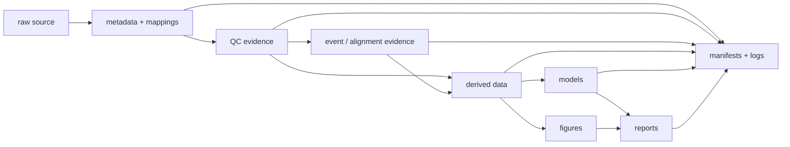

# Research project scaffold

<div class="gp-page-intro" data-research-project-scaffold>
Use this guide when you want a clean project structure before bringing research data into `gpbiometricspy`. The scaffold separates **source data, metadata, mappings, QC, events, derived tables, models, figures, reports, manifests, and logs** so later results remain traceable to the evidence that produced them.
</div>

<div class="gp-guide-grid" data-project-scaffold-stages>
<div class="gp-guide-card"><span class="gp-eyebrow">Source</span><h3>Keep raw exports immutable</h3><p>Store source files separately from cleaned or standardized data. Do not overwrite the only copy of an acquisition export.</p></div>
<div class="gp-guide-card"><span class="gp-eyebrow">Context</span><h3>Keep metadata beside the analysis</h3><p>Retain design tables, acquisition settings, participant/session/trial identifiers, device notes, and documented units.</p></div>
<div class="gp-guide-card"><span class="gp-eyebrow">Mapping</span><h3>Record every translation</h3><p>Save source-to-analysis column, event, AOI, condition, and clock mappings rather than relying on memory or hidden renaming code.</p></div>
<div class="gp-guide-card"><span class="gp-eyebrow">Evidence</span><h3>Separate QC from derived results</h3><p>Keep schema, missingness, signal activity, unit, timing, alignment, and exclusion evidence distinct from downstream feature tables.</p></div>
<div class="gp-guide-card"><span class="gp-eyebrow">Outputs</span><h3>Separate models, figures and reports</h3><p>Make model specifications, predictions, diagnostics, visual checkpoints, tables, and methods text easy to review independently.</p></div>
<div class="gp-guide-card"><span class="gp-eyebrow">Replay</span><h3>Bind the run with manifests and logs</h3><p>Keep software/configuration identity, warnings, decision records, and evidence manifests so a later rerun can explain what changed.</p></div>
</div>

## Create the scaffold

The repository includes a small checked generator:

```text
examples/hands-on/create-research-project-scaffold.py
```

From the repository root:

```bash
python examples/hands-on/create-research-project-scaffold.py
```

Choose another output location with:

=== "macOS / Linux"

    ```bash
    GPBIOMETRICSPY_PROJECT_DIR=analysis/my-study \
      python examples/hands-on/create-research-project-scaffold.py
    ```

=== "PowerShell"

    ```powershell
    $env:GPBIOMETRICSPY_PROJECT_DIR = "analysis/my-study"
    python examples/hands-on/create-research-project-scaffold.py
    ```

The generator creates **structure and templates only**. It does not copy private data, infer a schema, run preprocessing, or make scientific decisions.

## Resulting layout

```text
my-study/
├── README.md
├── raw/
│   └── README.md
├── metadata/
│   └── analysis-config.json
├── mappings/
│   └── column-mapping-template.csv
├── qc/
├── events/
├── derived/
├── models/
├── figures/
├── reports/
├── manifests/
│   └── project-scaffold.json
└── logs/
```

The separation is intentional. A convenient folder tree is not just housekeeping: it prevents source data, QC evidence, transformed outputs, and manuscript-ready results from becoming indistinguishable.

## What belongs where

| Location | Keep here | Avoid |
|---|---|---|
| `raw/` | immutable source exports when governance permits | cleaned files, overwritten originals, public sharing by default |
| `metadata/` | acquisition notes, design tables, device settings, study dictionaries, analysis configuration | final results detached from acquisition context |
| `mappings/` | column, event, condition, AOI, participant/session/trial, and clock mappings | undocumented renaming inside analysis scripts |
| `qc/` | schema, units, missingness, activity, artifact, validity, timebase, reset and readiness evidence | only a single “passed QC” flag |
| `events/` | extracted marker tables, alignment evidence, event windows, residuals/offsets | final event summaries without their event definitions |
| `derived/` | processed/analysis-ready tables with traceable inputs | source exports or undocumented manual edits |
| `models/` | specifications, diagnostics, certificates, predictions, uncertainty outputs | manuscript conclusions without model evidence |
| `figures/` | QC checkpoints and final figures | plots whose data/settings cannot be recovered |
| `reports/` | methods text, tables, summaries, manuscript-ready outputs | the only surviving copy of analysis evidence |
| `manifests/` | software identity, settings, checksums/identifiers where appropriate, artifact inventories | secrets, credentials, or unnecessary personal data |
| `logs/` | warnings, run logs, failures, version information | silent error suppression |

## Start with the mapping template

The generated `mappings/column-mapping-template.csv` begins with columns such as:

```text
original_name,analysis_name,role,unit,source,verified,notes
```

Treat it as a decision record. Add rows only after checking the export and acquisition documentation.

For example:

```text
subject_id,participant_id,identifier,,,true,study participant key
timestamp_s,TIME,time,seconds,Gazepoint export,true,recording clock
eda_us,GSR_US,signal,microsiemens,Gazepoint Biometrics,true,conductance channel
event_marker,TTL,event,,task computer,false,edge semantics still under review
```

The `verified` field is useful precisely because not every mapping is known at project start.

Continue with [Bring your own export safely](bring-your-own-export.md) for the checked source-to-standard adaptation workflow and the [Signal and column glossary](signal-column-glossary.md) for common field roles.

## Populate the analysis configuration deliberately

The generated `metadata/analysis-config.json` leaves core fields blank:

```json
{
  "participant_columns": [],
  "session_columns": [],
  "trial_columns": [],
  "time_column": null,
  "counter_column": null,
  "signal_columns": [],
  "validity_columns": [],
  "event_columns": [],
  "sampling_rate_hz": null,
  "time_unit": null,
  "coordinate_space": null
}
```

That is intentional. A template should not invent facts about your acquisition.

Populate these values only after checking:

1. the actual source export;
2. acquisition/software documentation;
3. observed timing intervals and resets;
4. validity semantics;
5. event-marker conventions;
6. participant/session/trial/stimulus identifiers;
7. coordinate space when gaze/AOI analysis is involved.

## A defensible project flow



The arrows represent provenance, not a requirement to duplicate every file. The key rule is that a downstream artifact should be explainable from retained upstream evidence.

## Recommended evidence checkpoints

### Before preprocessing

Retain:

- source identity and access rules;
- source-to-analysis mapping;
- schema inventory;
- signal presence/activity;
- units and validity semantics;
- observed timebase and sampling evidence;
- resets/discontinuities;
- event definitions and clock ownership.

Use [Validate a new dataset](validate-dataset.md) before substantive processing.

### Before event-locked or multimodal analysis

Retain:

- extracted event table;
- expected-versus-observed event coverage;
- duplicate/missing marker checks;
- time units for every stream;
- alignment method and settings;
- offsets, drift or residual evidence when estimated;
- event-window settings and group identifiers.

Use [Timebase and alignment](timebase-alignment.md) and the [Multimodal example](../examples/multimodal.md).

### Before modelling

Retain:

- analysis unit and grouping structure;
- feature provenance;
- exclusions and denominators;
- missing-data handling;
- prediction target and holdout unit;
- model specification and diagnostics;
- software/backend identity.

Use [Choose a modelling strategy](model-selection.md).

### Before manuscript or archive handoff

Retain:

- final tables/figures;
- methods text and settings;
- software identity;
- QC and model diagnostics;
- evidence manifest;
- explicit interpretation boundaries;
- enough metadata for another researcher to replay the workflow without private credentials.

Use [Reporting and reproducibility](reporting-reproducibility.md) and the runnable [Research evidence bundle](reporting-reproducibility.md#run-a-reviewable-evidence-bundle).

## Private-data boundary

Do not treat a repository structure as permission to commit participant data. Whether raw or derived data may be version-controlled, synchronized, uploaded, or shared depends on consent, ethics approvals, contracts, institutional policy, data-protection law, and the identifiability of the data.

A practical default is:

- keep private source data outside public repositories;
- version-control code, synthetic examples, schemas, mapping templates, and non-sensitive manifests;
- store only the metadata required for reproducibility;
- avoid secrets, credentials, direct identifiers, and unnecessary personal data in logs/manifests;
- document where restricted data are expected without publishing them.

## Common project-structure failures

| Failure | Consequence | Better pattern |
|---|---|---|
| `final_final_v3.csv` beside the source export | unclear lineage | separate `raw/` and `derived/`; record transformation/configuration |
| renamed columns with no mapping file | source semantics disappear | retain source-to-analysis mapping |
| QC tables overwritten by final summaries | exclusions become hard to audit | keep QC as its own evidence family |
| event-locked table without event table | window origin cannot be reviewed | retain event extraction and alignment evidence |
| figures saved without settings/data identity | plot cannot be replayed | keep configuration/manifests and source table identity |
| model output without grouping/holdout definition | prediction semantics become ambiguous | retain model specification/certificate and design notes |
| public repository used as raw-data storage | privacy/governance risk | keep restricted data in approved storage and publish synthetic/template artifacts instead |
| warnings discarded | diagnostics disappear | retain meaningful run logs and resolve warnings before interpretation |

## What the scaffold does not solve

The scaffold cannot decide whether a sensor is valid, whether an acquisition was synchronized, whether a signal measures a psychological construct, whether an exclusion is justified, or whether a statistical design identifies a causal effect. It only makes the evidence needed for those judgments easier to retain and review.

<div class="gp-science-boundary">
<strong>Evidence boundary.</strong> Good project structure improves provenance, reproducibility, privacy discipline, and reviewability. It does not transform uncertain measurement, timing, events, or models into valid scientific evidence. Resolve those questions in the corresponding QC, alignment, measurement, and modelling stages.
</div>

!!! tip "Need to diagnose an existing messy project?"
    Use [Troubleshooting and diagnostics](troubleshooting.md) to identify the earliest missing evidence, then move files into this structure only after preserving their original identity and lineage.
