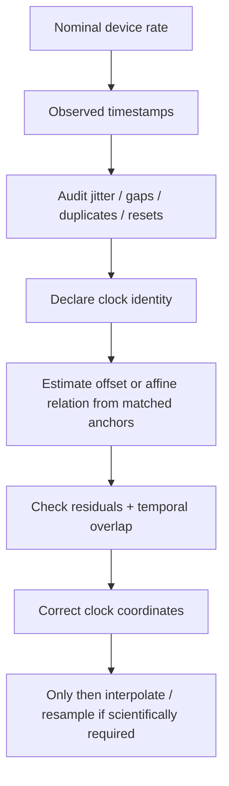

# Timebase and alignment

<div class="gp-page-intro">
Use this guide when an analysis depends on event timing, synchronization, or multiple recorded streams. The key distinction is between a nominal acquisition specification and timing behavior actually supported by recorded timestamps or matched anchors.
</div>

## The alignment hierarchy



Clock correction and signal interpolation are different operations. Keeping them separate makes it possible to report what timing evidence existed before any transformation.

## 1. Audit the observed timebase

At minimum, inspect:

- timestamp monotonicity;
- duplicate timestamps;
- backward steps or resets;
- observed inter-sample intervals;
- large gaps;
- jitter around the typical interval;
- counter-derived versus recorded timestamps;
- the amount of usable temporal overlap across streams.

The Python-native [timebase provenance method](../methods/timebase-provenance.md) formalizes these checks and binds the evidence into deterministic certificates.

## 2. Keep clock identity explicit

Do not infer a shared clock from column names alone. Record whether timestamps come from:

- the same acquisition application;
- device-local clocks;
- operating-system clocks;
- LSL timestamps;
- TTL markers captured by another device;
- counters converted to time;
- post-hoc exported timestamps.

If the clock identity is unknown, report it as unknown rather than silently treating streams as synchronized.

## 3. Use anchors for offset or drift estimation

When matched events exist in two clock domains, use them to estimate the relationship supported by the data. A constant offset is appropriate only when drift is negligible over the analysis period. An affine mapping can represent both offset and linear drift when the anchor design supports it.

```text
clock_B ≈ intercept + slope × clock_A
```

Residuals after fitting the mapping are evidence about anchor agreement under that model. They are not proof of hardware-level synchronization beyond the precision of the recorded anchors.

## 4. Correct clocks before resampling signals

A defensible order is:

1. preserve the original timestamps;
2. document the clock mapping;
3. create corrected time coordinates;
4. check positive overlap after correction;
5. define the analysis grid only if needed;
6. interpolate or aggregate with an explicitly chosen rule;
7. retain the resampling history.

## 5. LSL and external streams

A dependency-free example of preparing and aligning streams is available through the MNE/LSL workflow:

```python
import pandas as pd
import gpbiometricspy as gp

streams = {
    "gaze": pd.DataFrame({"time_s": [0.0, 1.0, 2.0], "x": [0.2, 0.3, 0.4]}),
    "bio": pd.DataFrame({"time_s": [0.1, 1.1, 2.1], "gsr": [1.0, 2.0, 3.0]}),
}

synced = gp.sync_gazepoint_signals_via_lsl(
    streams,
    reference="gaze",
    clock_offsets_s={"gaze": 0.0, "bio": -0.1},
)
```

For a fuller workflow, see [MNE, EEG and LSL interoperability](../articles/mne-eeg-lsl-workflow.md) and the [multimodal example](../examples/multimodal.md).

## Reporting checklist

Report enough information for a reader to reconstruct what “aligned” means in your study:

- original clock source for each stream;
- nominal and observed sampling information;
- number and type of anchors;
- offset/drift model used;
- residual error summary;
- any rejected anchors;
- overlap after correction;
- interpolation/resampling method and grid;
- whether analysis windows were defined before or after correction.

<div class="gp-science-boundary">
Small alignment residuals do not establish sub-millisecond hardware synchronization, causal ordering, or sensor validity. They describe agreement of the supplied timing evidence under the declared mapping.
</div>
