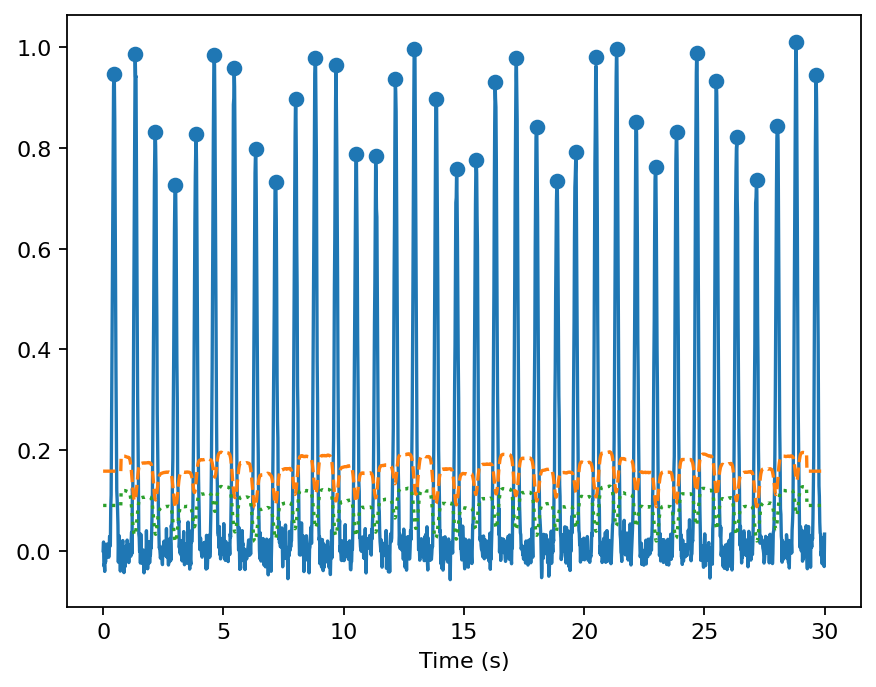

# gpbiometricspy

`gpbiometricspy` is the Python port of **gpbiometrics 2.0.0**, a Gazepoint-native toolkit for biometric and multimodal eye-tracking research.

<div class="gp-version-note">
<strong>Development documentation:</strong> this site tracks <code>main</code> (<code>0.1.3.dev0</code>). The latest stable release is <code>0.1.2</code>, archived at DOI <a href="https://doi.org/10.5281/zenodo.22150873">10.5281/zenodo.22150873</a>.
</div>

## Install

```bash
python -m pip install gpbiometricspy
```

The stable public package is distributed on [PyPI](https://pypi.org/project/gpbiometricspy/) and requires Python 3.11 or newer.

<div class="gp-hero">
<div class="gp-card"><h3>Examples</h3><p>Executable domain workflows using bundled synthetic/public data.</p><p><a href="examples/">Browse examples →</a></p></div>
<div class="gp-card"><h3>Plot gallery</h3><p>Real figures generated by the current Python plotting API.</p><p><a href="plot-gallery/">View plots →</a></p></div>
<div class="gp-card"><h3>26 articles</h3><p>Every frozen R vignette has an executable Python companion.</p><p><a href="articles/">Browse articles →</a></p></div>
<div class="gp-card"><h3>406-function API</h3><p>Complete exported-function reference for the parity surface.</p><p><a href="api/reference/">Open API →</a></p></div>
<div class="gp-card"><h3>Citation & archival</h3><p>GitHub citation metadata, Zenodo readiness and R-reference provenance.</p><p><a href="citation/">Citation details →</a></p></div>
</div>

## Visual preview

<div class="gp-gallery">
<figure><figcaption><strong>Multimodal timeline.</strong> EDA, heart-rate and pupil channels on a shared event-aligned time axis.</figcaption></figure>
<figure><figcaption><strong>EDA decomposition.</strong> Observed, tonic and phasic components.</figcaption></figure>
<figure><figcaption><strong>PPG peak detection.</strong> Deterministic pulse waveform and detected peaks.</figcaption></figure>
<figure><figcaption><strong>AOI-linked biometrics.</strong> Physiology and pupil summaries by area of interest.</figcaption></figure>
</div>

## Frozen parity contract

- 406 R exports → 406 Python implementations
- frozen R source, Rd help, tests and 26 article sources retained under `reference/`
- 26 executable Python article companions under `examples/tutorials/`
- synthetic kiosk demo included in the installable package
- test coverage gated at 90% or higher
- floor/current interoperability CI for external physiology and neurophysiology backends
- conservative physiological interpretation preserved

## Main workflow

```text
Gazepoint exports
  → import/schema audit
  → signal validity + timing/TTL QC
  → EDA / PPG / IBI / pupil / gaze preprocessing
  → event/AOI/multimodal alignment
  → feature extraction + model-ready tables
  → plots, reports, reproducibility and interoperability outputs
```

Start with [Getting started](getting-started.md), run the [Examples](examples/index.md), inspect the [Plot gallery](plot-gallery.md), browse the [26 articles](articles/index.md), review [Citation & archival](citation.md), or search the [406-function API](api/reference.md).
