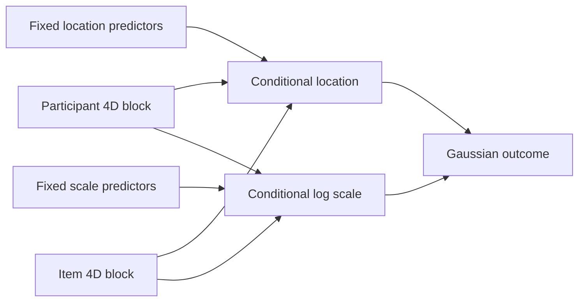

# Crossed participant–item joint random-slope location–scale modelling

> **Python-native certified development method.** This method is additive to the frozen **406/406** `gpbiometrics 2.0.0` parity surface. It is not an R-parity export and does not change that contract. The current scientific checkpoint is PR #136 at exact-main SHA `e761a931b00e646d6f12be3475a68cd524803893`.

The crossed joint random-slope model is the richest member of the current Gaussian location–scale family. It allows both crossed factors—typically **participant** and **item/stimulus**—to vary in:

1. the conditional outcome location;
2. the association between a numeric predictor and outcome location;
3. the conditional log residual scale; and
4. the association between a numeric predictor and log residual scale.

Each participant and each item therefore receives a four-dimensional latent block:

```text
(location intercept,
 location slope,
 log-scale intercept,
 log-scale slope)
```

with its own unrestricted positive-definite **4 × 4 covariance matrix**.

## Model

For observation \(n\), participant \(p[n]\), and item \(i[n]\),

\[
y_n \mid b_{p[n]}, c_{i[n]} \sim
\mathcal N(\mu_n, \sigma_n^2),
\]

with

\[
\mu_n = x_n^\top\beta
+ b_{p[n],0}
+ b_{p[n],1}r^{(L,p)}_n
+ c_{i[n],0}
+ c_{i[n],1}r^{(L,i)}_n,
\]

and

\[
\log \sigma_n = z_n^\top\gamma
+ b_{p[n],2}
+ b_{p[n],3}r^{(S,p)}_n
+ c_{i[n],2}
+ c_{i[n],3}r^{(S,i)}_n.
\]

Participant effects follow \(b_p \sim \mathcal N(0, \Sigma_P)\), and item effects follow \(c_i \sim \mathcal N(0, \Sigma_I)\). The two covariance matrices are estimated separately.

The location and scale random-slope predictors may be the same observed variable or different variables. Every random-slope predictor must also enter its corresponding fixed-effects equation.

## Why the latent field is integrated jointly

Participant and item effects are coupled by the observed crossed incidence pattern. With \(P\) participants and \(I\) items, the latent dimension is

\[
4(P + I).
\]

The implementation therefore uses one **joint dense Laplace approximation** rather than independent group-by-group quadrature. Analytic latent gradients and Hessians feed a damped Newton posterior-mode solver; fixed effects and covariance parameters are then optimized with bounded L-BFGS-B.



## Design guards

The method fails closed when its random structure is not supported by the supplied design.

- At least **eight participants** and **eight items** are required.
- Every location random-slope predictor must be numeric, included in `mean_cols`, and vary within **every** corresponding participant/item level.
- Every scale random-slope predictor must be numeric, included in `scale_cols`, and vary within **every** corresponding participant/item level.
- The crossed incidence checks inherited from the base crossed model remain active.
- The dense latent field is bounded by `max_latent_dimension`.
- Final certification is blocked for non-converged fits.

These checks are scientific constraints, not optional warnings.

## Example

```python
from gpbiometricspy.hierarchical_location_scale_crossed_joint_random_slopes import (
    create_gazepoint_crossed_hierarchical_location_scale_joint_random_slopes_certificate,
    fit_gazepoint_crossed_hierarchical_location_scale_joint_random_slopes,
    predict_gazepoint_crossed_hierarchical_location_scale_joint_random_slopes,
    simulate_gazepoint_crossed_hierarchical_location_scale_joint_random_slopes,
    validate_gazepoint_crossed_hierarchical_location_scale_joint_random_slopes_certificate,
)

# Fully synthetic known-truth crossed design.
data = simulate_gazepoint_crossed_hierarchical_location_scale_joint_random_slopes(
    n_participants=8,
    n_items=8,
    repeats=2,
    seed=1201,
)

fit = fit_gazepoint_crossed_hierarchical_location_scale_joint_random_slopes(
    data,
    "outcome",
    "participant",
    "item",
    participant_location_random_slope_col="participant_location_predictor",
    item_location_random_slope_col="item_location_predictor",
    participant_scale_random_slope_col="participant_scale_predictor",
    item_scale_random_slope_col="item_scale_predictor",
    mean_cols=[
        "mean_predictor",
        "participant_location_predictor",
        "item_location_predictor",
    ],
    scale_cols=[
        "participant_scale_predictor",
        "item_scale_predictor",
    ],
)

prediction = predict_gazepoint_crossed_hierarchical_location_scale_joint_random_slopes(
    fit,
    data.iloc[:8],
)

certificate = (
    create_gazepoint_crossed_hierarchical_location_scale_joint_random_slopes_certificate(
        fit
    )
)
assert validate_gazepoint_crossed_hierarchical_location_scale_joint_random_slopes_certificate(
    fit,
    certificate,
)
```

## Conditional and population prediction

For a participant or item observed during fitting, prediction can use the empirical-Bayes latent mode for that level. For unseen levels, the corresponding random effect is unavailable and prediction reverts to the population component.

The returned `prediction_level` therefore distinguishes:

- `conditional_participant_item`;
- `conditional_participant_population_item`;
- `population_participant_conditional_item`;
- `population_participant_item`; and
- `population_fixed_effects` when random effects are disabled.

Use `unknown_levels="error"` when a workflow is intended to be strictly conditional and unseen levels should stop execution.

## What the covariance matrices mean

Within each crossed factor, the 4 × 4 covariance matrix describes estimated covariance among:

- location intercept heterogeneity;
- location-slope heterogeneity;
- log-scale intercept heterogeneity; and
- log-scale-slope heterogeneity.

These are model-based association structures. They are **not** error-free participant traits, stimulus-quality scores, reliability coefficients, artifact probabilities, or causal mechanisms.

## Interpretation boundary

The model does **not** by itself:

- identify or correct eye-tracking, motion, PPG, ECG or EDA artifacts;
- establish sensor validity or reliability;
- perform sensor-validity weighting;
- show that a predictor caused a change in mean or variability;
- infer emotion, stress, trust, preference, cognition, diagnosis or another latent state;
- reconstruct information absent from the recorded signal; or
- justify richer random structures when the design does not support them.

Location random slopes estimate heterogeneity in an observed conditional-mean association. Log-scale random slopes estimate heterogeneity in an observed residual-dispersion association. Both remain conditional on the fitted specification and acquisition design.

## Computational boundary

A dense Laplace Hessian scales with the full latent dimension. This method is therefore intended for scientifically justified crossed designs of moderate latent size, not arbitrary high-dimensional random-effects grammars. Increase `max_latent_dimension` only after considering memory, runtime, replication, and covariance-recovery evidence.

## Relationship to the simpler crossed models

| Crossed model | Participant/item block | Use when |
|---|---|---|
| [Crossed intercepts](crossed-location-scale.md) | location intercept + log-scale intercept | both crossed factors contribute mean/dispersion heterogeneity |
| [Crossed location slopes](crossed-random-slopes-location-scale.md) | location intercept + location slope + log-scale intercept | mean association varies by participant and item |
| [Crossed scale slopes](crossed-random-scale-slopes-location-scale.md) | location intercept + log-scale intercept + log-scale slope | residual-dispersion association varies by participant and item |
| **Crossed joint slopes** | location intercept + location slope + log-scale intercept + log-scale slope | both mean and dispersion associations require crossed random slopes |

Model escalation should be driven by the scientific contrast and design support, not by a preference for the richest specification.

## Certified validation status

PR **#136** is formally exact-main certified at SHA **`e761a931b00e646d6f12be3475a68cd524803893`**, tree **`313ce0a801daf0ae7c4b9ce7a9e0af4610094994`**. Its sole parent is `0b7084352362d297dc05f127d4bcbc924cd24873`; the merge tree exactly matches the qualified candidate tree and the GitHub signature is verified/valid.

The fresh post-merge generation is **14/14 workflow families green**. Tests #634 is **12/12 platform/Python lanes green**; the canonical Ubuntu 24.04.5 / CPython 3.12.14 lane passes **850/850 tests**, **15,171/15,171 statements**, Ruff/compile clean, and **406/406 frozen exports with 0 pending**. Branch Coverage #412 reports **7,159/7,178 = 99.7353% raw branches**, the same **19 audited** residual structural/caller-dominated arcs, and **0 unexpected / 0 stale / 0 unaudited** branch debt. The branch evidence artifact is **10389944415**, SHA-256 `9cc448013e4be26caf22de120089ba649c928aee0989728fdbf77e5409528abf`.

Interoperability #622 is **14/14** across the real optional-backend matrix, and Deep Parity, private real-data validation, CodeQL, strict Docs/Pages, and all Studio readiness families are green. Formal certification checkpoint: PR #136 comment **5678239576**.

A later documentation-only/site descendant may describe this state but does not replace `e761a931…` as the scientific certification anchor.