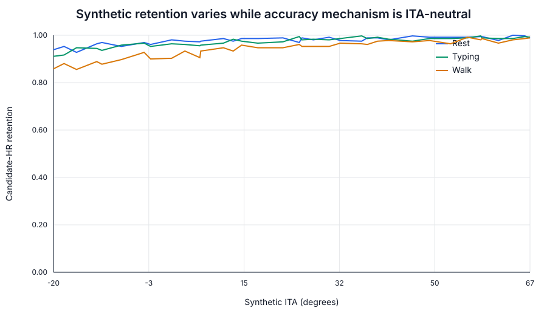
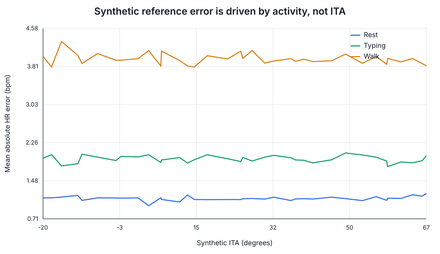
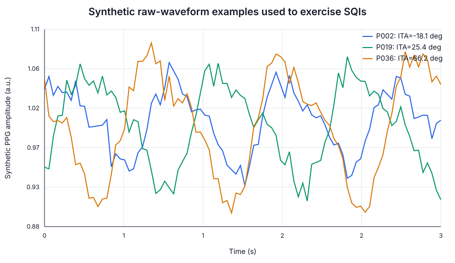

# PPG pigmentation & measurement-equity audit

<script>
window.MathJax = {tex: {inlineMath: [["\\(", "\\)"]], displayMath: [["\\[", "\\]"]], processEscapes: true}};
</script>
<script defer src="https://cdn.jsdelivr.net/npm/mathjax@3/es5/tex-mml-chtml.js"></script>

<div class="gp-page-intro">
`gpbiometricspy.ppg_equity` is a Python-native measurement-accountability layer for optical PPG workflows. It keeps **pigmentation provenance**, **raw signal quality**, **data retention**, and **reference agreement** separate so that one stable error statistic cannot hide differential missingness or acquisition quality.
</div>

<div class="gp-version-note">
<strong>Post-0.1.7 development feature.</strong> This functionality is present on current development <code>main</code> but is not part of the frozen 0.1.7 release. The next release will be frozen only after the evidence/documentation tranche is complete.
</div>

## Start with the scientific question

The audit is designed to answer five questions in order:

1. **Was pigmentation actually measured?**
2. **How, where, and with which instrument was it measured?**
3. **Did raw PPG quality or data retention vary across the observed pigmentation range?**
4. **Did paired reference accuracy vary?**
5. **Do those patterns change across device/activity/acquisition context?**

The module does **not** infer pigmentation from race or ethnicity, does not label a device "fair" or "unfair", does not apply a pigmentation-based correction, and does not automatically exclude observations because of pigmentation.

## The three analytical layers

\[
\boxed{\text{Acquisition quality}}
\;\longrightarrow\;
\boxed{\text{Retention / missingness}}
\;\longrightarrow\;
\boxed{\text{Reference agreement}}
\]

The layers are related but not interchangeable. A device can show stable MAE while retaining substantially fewer observations in part of the measured pigmentation range.





The figures above come from the deterministic [synthetic worked example](../examples/ppg-equity-synthetic/). They are deliberately constructed so retention varies while the HR-error mechanism is ITA-neutral.

## Public Python-native surface

```python
from gpbiometricspy.ppg_equity import (
    compute_skin_ita,
    validate_skin_pigmentation_metadata,
    summarize_ppg_quality_by_pigmentation,
    compare_ppg_reference_by_pigmentation,
    ppg_pigmentation_audit,
)
```

These functions are additive Python-native methods and are intentionally **outside the frozen 406-export R-parity registry**.

## 1. Objective pigmentation and ITA

When CIELAB measurements are available, the package derives Individual Typology Angle as

\[
ITA^\circ = \arctan\left(\frac{L^*-50}{b^*}\right)\frac{180}{\pi}.
\]

```python
ita = compute_skin_ita(
    l_star=[68.4, 55.1, 39.8],
    b_star=[18.7, 20.2, 16.4],
    classify=True,
)
```

The continuous ITA is primary. Conventional ITA categories are available for presentation but are not treated as interchangeable with Monk Skin Tone, Fitzpatrick phototype, Pantone, von Luschan, race, ethnicity, or melanin-index measurements.

`validate_skin_pigmentation_metadata()` preserves method, measurement site, PPG sensor site, instrument, assessor, raw CIELAB values, derived ITA, missingness provenance, and whether measurement/sensor sites match.

```python
meta = validate_skin_pigmentation_metadata(
    data,
    metric="cielab",
    l_star_col="skin_L_star",
    a_star_col="skin_a_star",
    b_star_col="skin_b_star",
    method="colorimetry",
    measurement_site="pigmentation_site",
    sensor_site="sensor_site",
    instrument_manufacturer="instrument_vendor",
    instrument_model="instrument_model",
    missing_reason_col="pigmentation_missing_reason",
)
```

### Evidence classes

| Evidence class | Examples | Analytical default |
| --- | --- | --- |
| Objective | ITA, CIELAB-derived ITA, melanin index | continuous descriptive association + optional strata |
| Subjective | Monk, Fitzpatrick, Pantone, von Luschan | descriptive strata only |
| Demographic proxy | race, ethnicity | **not treated as pigmentation** |

If only race/ethnicity is supplied, the integrated report explicitly records that pigmentation was **not measured** and skips pigmentation-stratified optical analysis.

## 2. Raw PPG quality

`summarize_ppg_quality_by_pigmentation()` reuses the existing Gazepoint HRP waveform-quality path and adds descriptive PPG SQIs.

```python
quality = summarize_ppg_quality_by_pigmentation(
    data,
    participant_col="participant",
    ppg_col="HRP",
    pigmentation_col="ita_degrees",
    pigmentation_metric="ita",
    time_col="time_s",
    group_cols=["activity"],
    sampling_rate_hz=60,
    n_boot=1000,
    random_state=20261003,
)
```

A robust AC amplitude is

\[
AC = \frac{Q_{0.95}(PPG)-Q_{0.05}(PPG)}{2},
\]

with

\[
DC=\operatorname{median}(PPG),
\qquad
AC/DC=\frac{AC}{|DC|}.
\]

The spectral signal-to-noise statistic is

\[
SNR_{dB}=10\log_{10}\left(\frac{P_{pulse}}{P_{noise}}\right).
\]

The quality table also retains finite/missing proportions, flatness, sampling-rate provenance, beat-template correlation, and the existing waveform-QC status.



No one SQI automatically defines scientific validity.

## 3. Retention as its own outcome

The reference-analysis denominator is intentionally different from the paired-error denominator. If a reference measurement exists but the candidate PPG-derived value is absent, the row contributes to **retention** even though it cannot contribute to MAE.

For objective pigmentation, a descriptive retention association is estimated conceptually as

\[
\operatorname{logit}\{P(R_{ij}=1)\}
=\gamma_0+\gamma_1 ITA_i,
\]

where repeated observations remain clustered within participant.

The reported odds ratio is scaled per 10 pigmentation units:

\[
OR_{10}=\exp(10\gamma_1).
\]

This is an association, not a causal optical mechanism.

## 4. Reference agreement

```python
agreement = compare_ppg_reference_by_pigmentation(
    data,
    participant_col="participant",
    reference_col="ecg_hr",
    candidate_col="ppg_hr",
    pigmentation_col="ita_degrees",
    pigmentation_metric="ita",
    metric_name="heart_rate",
    device_col="device",
    condition_col="activity",
    n_boot=1000,
    random_state=20261003,
)
```

The paired-measurement outputs include

\[
\text{Bias}=\frac{1}{n}\sum_{k=1}^n d_k,
\qquad d_k=Y_k-X_k,
\]

\[
MAE=\frac{1}{n}\sum_{k=1}^n |d_k|,
\]

\[
RMSE=\sqrt{\frac{1}{n}\sum_{k=1}^n d_k^2},
\]

and Bland--Altman limits

\[
\bar d\pm1.96s_d.
\]

Lin's concordance correlation coefficient is

\[
\rho_c=\frac{2\operatorname{cov}(X,Y)}{\operatorname{var}(X)+\operatorname{var}(Y)+(\mu_X-\mu_Y)^2}.
\]

The result object keeps agreement, bootstrap confidence intervals, pigmentation strata, continuous associations when scientifically appropriate, retention association, and row-level analysis flags separate.

## 5. Participant-cluster uncertainty

Waveform and repeated-HR rows from the same participant are not independent. The bootstrap therefore resamples **participants** rather than individual signal samples.

For bootstrap replicate \(b\),

\[
\mathcal I^{(b)}=\{i_1^{(b)},\ldots,i_N^{(b)}\},
\]

where participant identifiers are sampled with replacement and all their rows are retained together. The default 95% interval uses the 2.5th and 97.5th percentiles of the bootstrap distribution.

## 6. Integrated audit

```python
result = ppg_pigmentation_audit(
    data,
    participant_col="participant",
    ppg_col="HRP",
    pigmentation_metric="cielab",
    l_star_col="skin_L_star",
    a_star_col="skin_a_star",
    b_star_col="skin_b_star",
    pigmentation_method="colorimetry",
    pigmentation_site="finger",
    sensor_site="finger",
    instrument_manufacturer="Vendor",
    instrument_model="Model",
    time_col="time_s",
    group_cols=["activity"],
    sampling_rate_hz=60,
    reference_col="ecg_hr",
    candidate_col="ppg_hr",
    metric_name="heart_rate",
    device_col="device",
    condition_col="activity",
    n_boot=1000,
    random_state=20261003,
)
```

Main result objects:

```text
metadata
acquisition_quality
reference_agreement
warnings
reporting_text
provenance
settings
```

If no reference/candidate pair is supplied, reference agreement is returned as `not_assessed`. If only a demographic proxy is supplied, pigmentation analysis is not silently substituted.

## Synthetic worked example

The deterministic synthetic example is the executable teaching and regression artifact for this method.

**[Open the complete synthetic worked example →](../examples/ppg-equity-synthetic/)**

It documents the data-generating process in equations, explains every output family, regenerates the figures on this page, and demonstrates the central distinction:

\[
\text{amplitude}\neq\text{quality}\neq\text{retention}\neq\text{accuracy}.
\]

Generate it with:

```bash
python scripts/generate_ppg_equity_synthetic_demo.py \
  --output-dir docs/assets/ppg-equity \
  --seed 20261003 \
  --participants 36 \
  --n-boot 400
```

## External evidence: STEP and ENCoDE

The pre-release external-evidence programme is documented separately:

**[Open the STEP + ENCoDE external-evidence protocol →](../ppg-equity-external-evidence/)**

Two executable adapters are included:

```bash
python scripts/run_step_ppg_equity_evidence.py \
  --csv /secure/path/to/step.csv \
  --output-dir external-evidence/step

python scripts/run_encode_pigmentation_schema_stress.py \
  --data-dir /secure/path/to/encode \
  --output-dir external-evidence/encode
```

The public repository does **not** redistribute either restricted dataset. Current status is explicit:

| Evidence layer | STEP | ENCoDE |
| --- | --- | --- |
| official public schema/source verified | yes | yes |
| adapter implemented | yes | yes |
| contract-faithful synthetic fixture tested | yes | yes |
| restricted source rows empirically executed in public repo | **no** | **no** |

This distinction is deliberate. The repository will not claim external empirical validation until authorized local data have actually been run.

## Scientific anchors for the STEP adapter

The original STEP study evaluated 53 participants across six wearable devices and multiple activities. It reported no overall skin-tone association with HR measurement error in the marginal model, substantial device/activity effects, and a skin-tone-by-device interaction. Those historical results are useful **anchors**, not pass/fail targets for the package.

The adapter therefore preserves device and activity strata and reports retention separately from paired error rather than attempting to recreate one headline p-value.

## Anatomical site and acquisition configuration

Where available, retain:

- pigmentation measurement site;
- PPG sensor site;
- method and instrument;
- device manufacturer/model and firmware;
- wavelength or wavelength set;
- source--detector geometry;
- sampling rate;
- contact pressure/fit;
- activity and posture;
- ambient/skin temperature;
- tattoo/hair/site context.

Unknown values remain unknown. Device category is never used to invent wavelength or optical geometry.

## Interpretation boundary

Safe generated wording looks like:

> PPG waveform retention decreased across the observed objective pigmentation range in this sample. Because pigmentation was observational and acquisition conditions may differ across participants, the association does not establish pigmentation or melanin as the causal source of the difference.

Or:

> Reference heart-rate error showed little evidence of association with the objective pigmentation measure, while usable-data retention differed across the observed range.

Avoid:

- "the device is unbiased across skin tones" based only on paired error;
- "dark skin caused poorer PPG performance" from observational association;
- "race was used as skin tone";
- "the software corrected skin-tone bias".

## Scope boundary

This tranche covers PPG waveform quality, pulse/heart rate, beat/IBI retention, and metric-specific PRV/HRV comparison. It is **not** a clinical pulse-oximeter validation module.

A future SpO2/SaO2 extension would require paired arterial reference measurements, desaturation-range coverage, pulse-oximeter-specific standards, ARMS, diagnostic-threshold behavior, and clinical validation language. Those claims are intentionally outside the current module.
