# Plot gallery

This gallery is generated by **gpbiometricspy itself** from bundled synthetic/public demonstration data. The figures are not screenshots or hand-drawn mockups: `scripts/generate_docs_gallery.py` executes the current Python plotting API and writes the images used by this page.

<div class="gp-version-note">
<strong>Development documentation.</strong> The website tracks <code>main</code> (<code>0.1.2.dev0</code>). The latest stable PyPI release remains <code>0.1.1</code>.
</div>

Regenerate the complete gallery locally with:

```bash
PYTHONPATH=src python scripts/generate_docs_gallery.py
```

## Signal overview and quality

<div class="gp-gallery">
<figure>
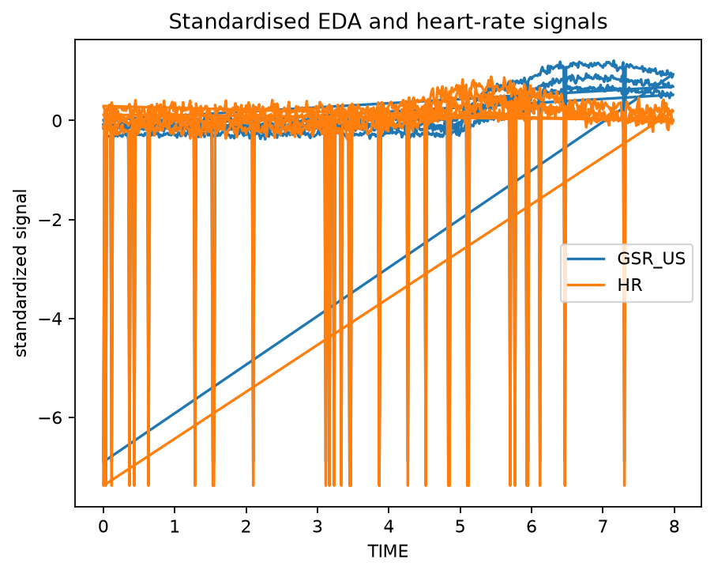
<figcaption><strong>Biometric signal overview.</strong> Standardised EDA and heart-rate traces from the bundled kiosk demonstration.</figcaption>
</figure>
<figure>
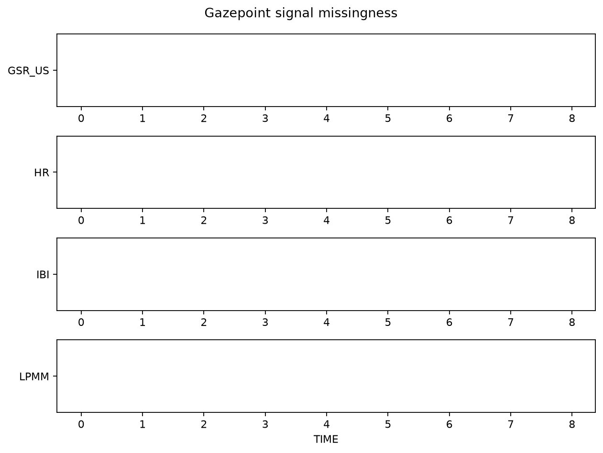
<figcaption><strong>Missingness overview.</strong> Channel-level availability across EDA, heart-rate, IBI and pupil measurements.</figcaption>
</figure>
<figure>
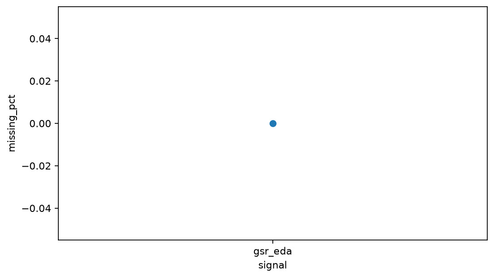
<figcaption><strong>Signal-quality diagnostic.</strong> A compact core-QC summary suitable for preprocessing review.</figcaption>
</figure>
</div>

## EDA and SCR

<div class="gp-gallery">
<figure>
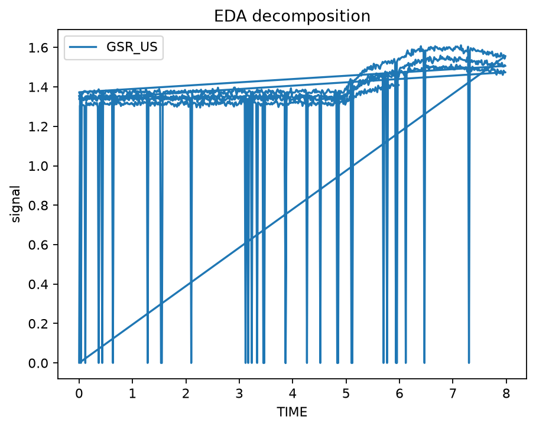
<figcaption><strong>EDA decomposition.</strong> Observed signal with tonic and phasic components.</figcaption>
</figure>
<figure>
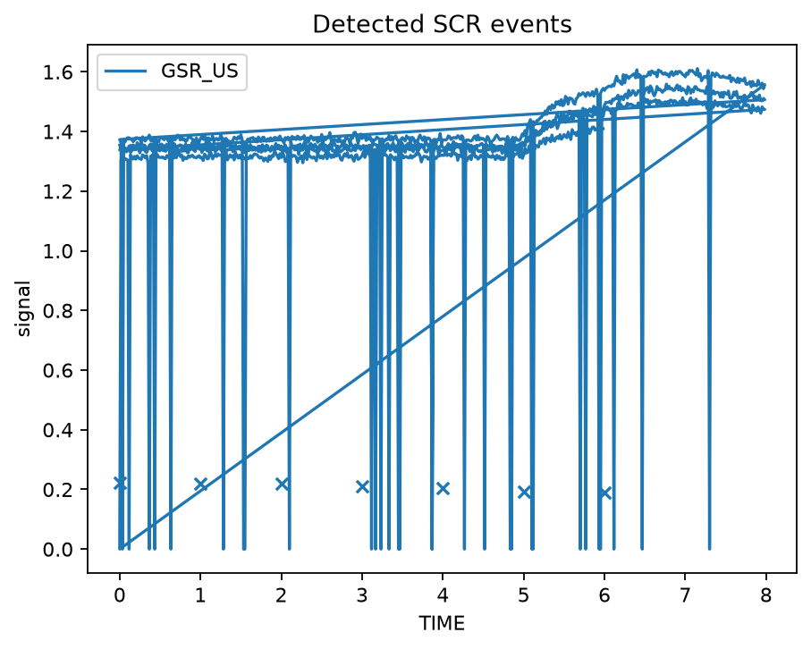
<figcaption><strong>SCR events.</strong> Deterministically detected skin-conductance responses over the EDA trace.</figcaption>
</figure>
<figure>
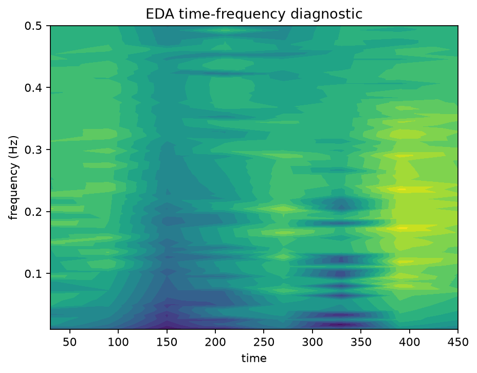
<figcaption><strong>EDA-gram.</strong> Time-frequency diagnostic for slow electrodermal dynamics.</figcaption>
</figure>
</div>

## PPG and HRV

<div class="gp-gallery">
<figure>
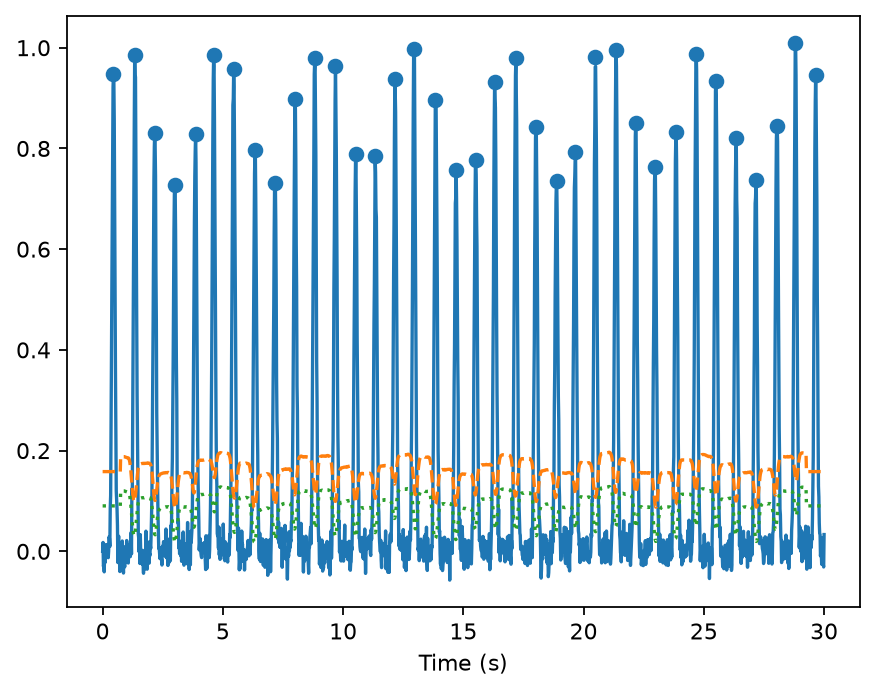
<figcaption><strong>PPG peak detection.</strong> Pulse waveform and accepted peaks from the deterministic synthetic generator.</figcaption>
</figure>
<figure>
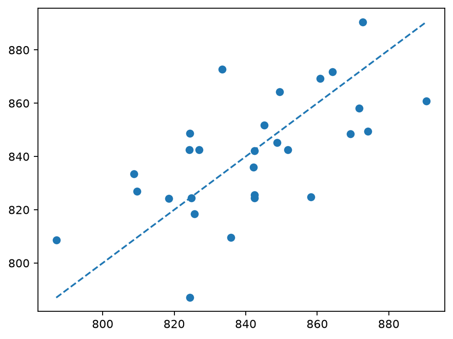
<figcaption><strong>Poincaré plot.</strong> Beat-to-beat geometry for HRV inspection.</figcaption>
</figure>
<figure>
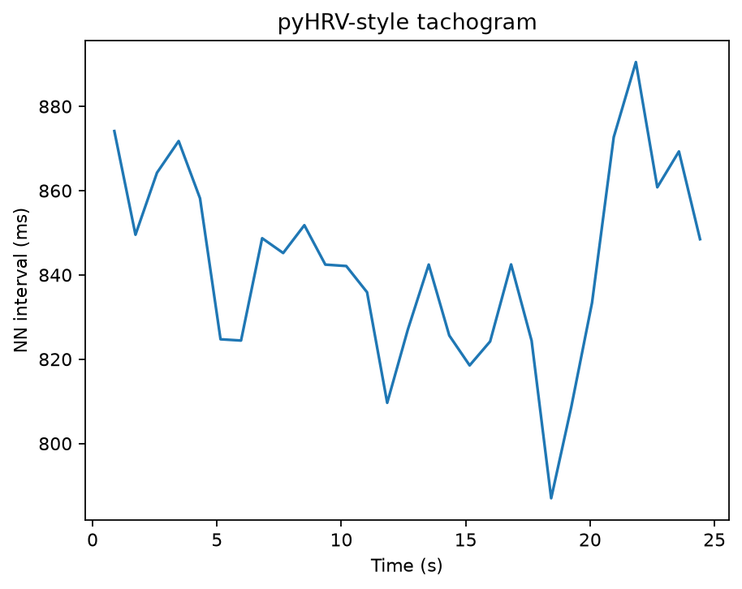
<figcaption><strong>HRV tachogram.</strong> Beat-to-beat interval trajectory through the pyHRV-style visual interface.</figcaption>
</figure>
</div>

## Pupil, gaze and AOIs

<div class="gp-gallery">
<figure>
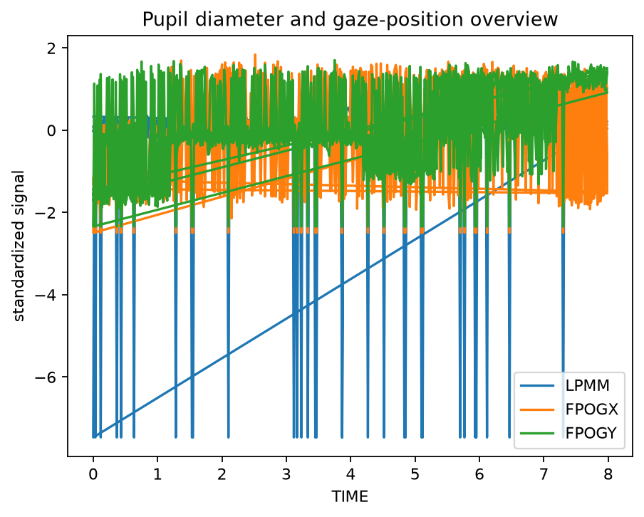
<figcaption><strong>Pupil and gaze overview.</strong> Standardised pupil diameter and gaze coordinates for one synthetic participant.</figcaption>
</figure>
<figure>
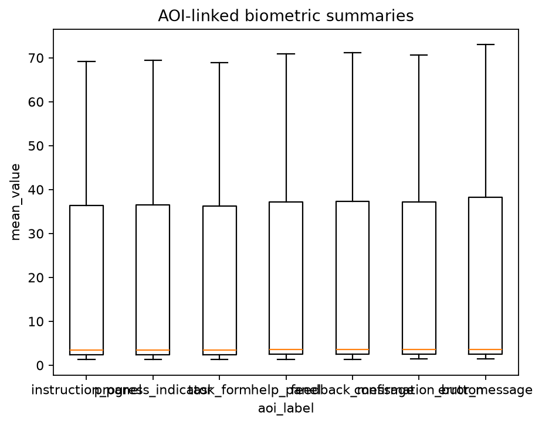
<figcaption><strong>AOI-linked biometrics.</strong> EDA, heart-rate and pupil summaries grouped by areas of interest.</figcaption>
</figure>
<figure>
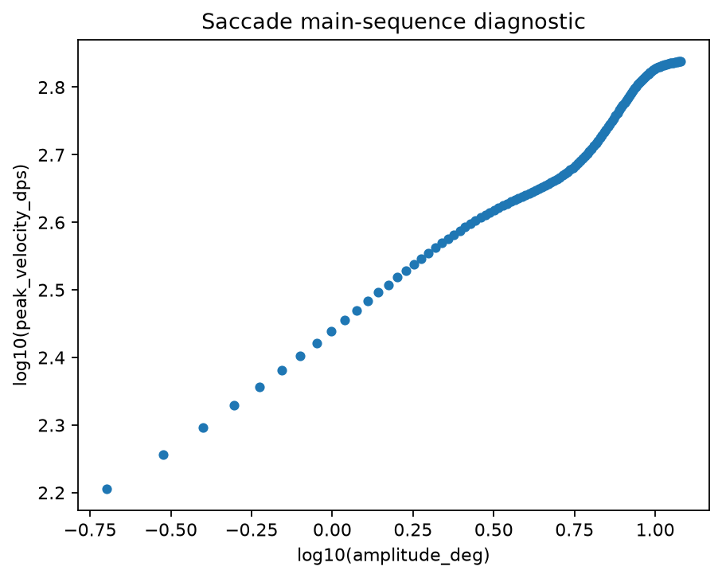
<figcaption><strong>Saccade main sequence.</strong> Amplitude/peak-velocity relationship used as a gaze-quality diagnostic.</figcaption>
</figure>
</div>

## Multimodal alignment

<div class="gp-gallery">
<figure>
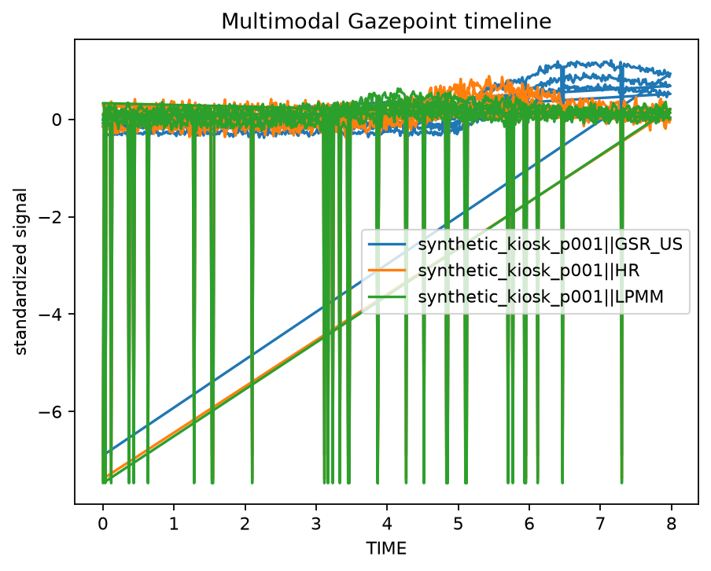
<figcaption><strong>Multimodal timeline.</strong> Synchronous EDA, heart-rate and pupil channels with event markers.</figcaption>
</figure>
</div>

## Where the code lives

Every image above is generated from public package functions. See the [domain examples](examples/index.md), the [26 executable article companions](articles/index.md), and the [406-function API reference](api/reference.md) for the corresponding code and workflow context.
