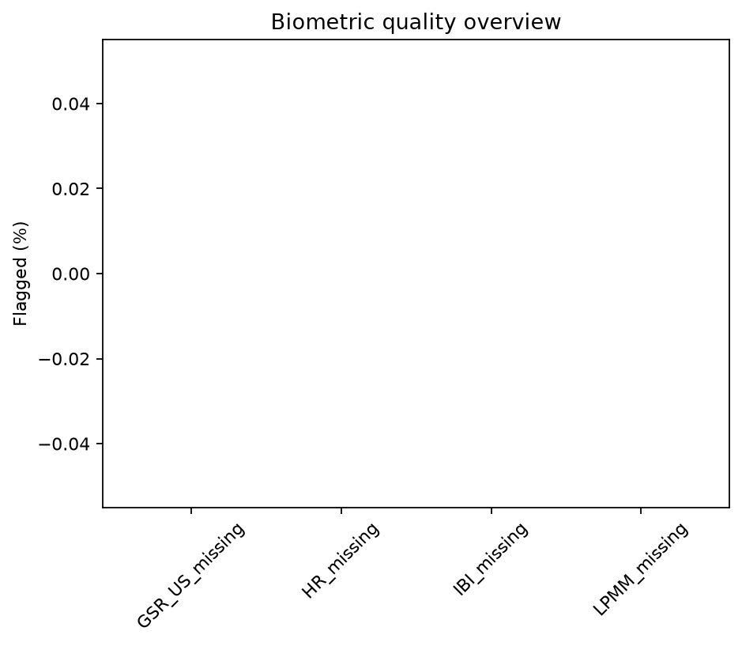
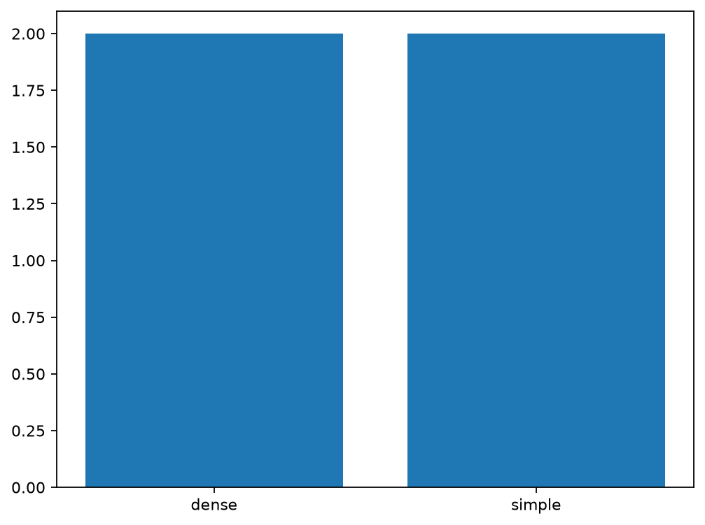
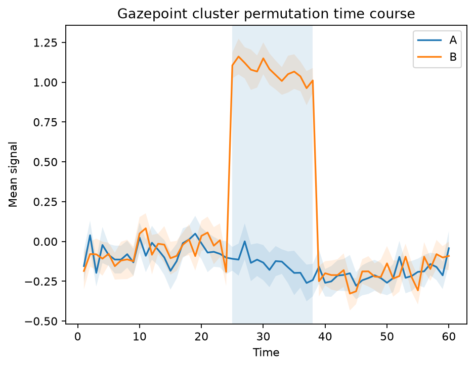
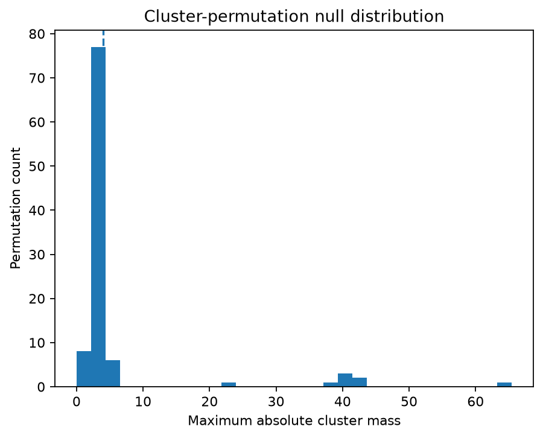

# Plot gallery

<div class="gp-page-intro">
This gallery is generated by **gpbiometricspy itself** from bundled synthetic/public demonstration data. The figures are not screenshots or hand-drawn mockups: `scripts/generate_docs_gallery.py` executes the current checked-out Python plotting API and writes the images used by this page.
</div>

<div class="gp-version-note">
<strong>Current development documentation.</strong> The gallery is regenerated in documentation CI from the checked-out package source. The stable <code>0.1.6</code> release keeps its own immutable release evidence; development-line figures do not rewrite that historical record.
</div>

Regenerate the complete gallery locally with:

```bash
PYTHONPATH=src python scripts/generate_docs_gallery.py
python scripts/validate_docs_site.py
```

<div class="gp-metric-grid">
<div class="gp-metric-card"><strong>17</strong><span>deterministically generated documentation figures</span></div>
<div class="gp-metric-card"><strong>6</strong><span>major workflow domains represented visually</span></div>
<div class="gp-metric-card"><strong>0</strong><span>private participant datasets required</span></div>
<div class="gp-metric-card"><strong>CI</strong><span>gallery manifest and site references validated on every docs build</span></div>
</div>

## Signal overview and quality

<div class="gp-gallery">
<figure>

<figcaption><strong>Biometric signal overview.</strong> Standardised EDA and heart-rate traces from the bundled kiosk demonstration.</figcaption>
</figure>
<figure>

<figcaption><strong>Missingness overview.</strong> Channel-level availability across EDA, heart-rate, IBI and pupil measurements.</figcaption>
</figure>
<figure>

<figcaption><strong>Signal-quality diagnostic.</strong> A compact core-QC summary suitable for preprocessing review.</figcaption>
</figure>
<figure>

<figcaption><strong>Biometric quality overview.</strong> A broader multi-channel view for manual QC and reporting.</figcaption>
</figure>
</div>

## EDA and SCR

<div class="gp-gallery">
<figure>

<figcaption><strong>EDA decomposition.</strong> Observed signal with tonic and phasic components.</figcaption>
</figure>
<figure>

<figcaption><strong>SCR events.</strong> Deterministically detected skin-conductance responses over the EDA trace.</figcaption>
</figure>
<figure>

<figcaption><strong>EDA-gram.</strong> Time-frequency diagnostic for slow electrodermal dynamics.</figcaption>
</figure>
</div>

## PPG and HRV

<div class="gp-gallery">
<figure>

<figcaption><strong>PPG peak detection.</strong> Pulse waveform and accepted peaks from the deterministic synthetic generator.</figcaption>
</figure>
<figure>

<figcaption><strong>Poincaré plot.</strong> Beat-to-beat geometry for interval-variability inspection.</figcaption>
</figure>
<figure>

<figcaption><strong>HRV/PRV-style tachogram.</strong> Beat-to-beat interval trajectory through the pyHRV-style visual interface; scientific naming still depends on source provenance.</figcaption>
</figure>
</div>

## Pupil, gaze and AOIs

<div class="gp-gallery">
<figure>

<figcaption><strong>Pupil and gaze overview.</strong> Standardised pupil diameter and gaze coordinates for one synthetic participant.</figcaption>
</figure>
<figure>

<figcaption><strong>AOI-linked biometrics.</strong> EDA, heart-rate and pupil summaries grouped by areas of interest.</figcaption>
</figure>
<figure>

<figcaption><strong>Saccade main sequence.</strong> Amplitude/peak-velocity relationship used as a gaze-event diagnostic.</figcaption>
</figure>
</div>

## Multimodal alignment

<div class="gp-gallery">
<figure>

<figcaption><strong>Multimodal timeline.</strong> Synchronous EDA, heart-rate and pupil channels with event markers on the demonstration timebase.</figcaption>
</figure>
</div>

## Design and inference

<div class="gp-gallery">
<figure>

<figcaption><strong>Design coverage.</strong> Condition/trial coverage inspected before modelling so sparse or imbalanced cells remain visible.</figcaption>
</figure>
<figure>

<figcaption><strong>Cluster-permutation time course.</strong> A deterministic synthetic two-condition effect with detected cluster information. Cluster timing is descriptive rather than precise onset evidence.</figcaption>
</figure>
<figure>

<figcaption><strong>Cluster null distribution.</strong> The global permutation reference distribution used by the synthetic cluster example.</figcaption>
</figure>
</div>

## Read the figures as diagnostics

The gallery is designed to make intermediate evidence visible. A diagnostic plot is not a scientific conclusion by itself:

- missingness and quality plots document recorded-data properties;
- decomposition and peak plots document transformations and detection behavior;
- gaze plots document measured or derived eye-tracking behavior;
- design plots document coverage;
- cluster plots summarize an inferential procedure under its stated exchangeability assumptions;
- multimodal plots show aligned coordinates but do not prove hardware synchronization.

## Where the code lives

Every image above is generated from public package functions. See the [domain examples](examples/index.md), the [26 executable frozen R-companion articles](articles/index.md), the [Python-native explanation articles](articles/python-native/index.md), and the [406-function API reference](api/reference.md) for corresponding code and workflow context.
