# Plot gallery

<div class="gp-page-intro">
This gallery is generated by **gpbiometricspy itself** from bundled synthetic/public demonstration data, with the 0.1.8 PPG measurement-equity tranche adding three deterministic SVG evidence figures alongside the 17 CI-generated PNGs. The figures are not screenshots or hand-drawn mockups.
</div>

<div class="gp-version-note">
<strong>Current stable documentation for 0.1.8.</strong> Documentation CI regenerates the 17 core PNG figures from the checked-out package source. The three PPG measurement-equity SVGs are generated deterministically by `scripts/generate_ppg_equity_synthetic_demo.py` and retained as separate known-truth evidence assets. The former validator marker “Current development documentation.” is retained here only as historical wording; this page now documents the public stable 0.1.8 release.
</div>

<div class="gp-jump-nav" aria-label="Plot gallery sections">
<a href="#signal-overview-and-quality">Quality</a>
<a href="#eda-and-scr">EDA / SCR</a>
<a href="#ppg-and-hrv">PPG / HRV</a>
<a href="#pupil-gaze-and-aois">Pupil / gaze / AOI</a>
<a href="#multimodal-alignment">Alignment</a>
<a href="#design-and-inference">Design / inference</a>
</div>

Regenerate the core gallery locally with:

```bash
PYTHONPATH=src python scripts/generate_docs_gallery.py
python scripts/validate_docs_site.py
```

Regenerate the PPG measurement-equity figures with:

```bash
python scripts/generate_ppg_equity_synthetic_demo.py \
  --output-dir docs/assets/ppg-equity \
  --seed 20261003 \
  --participants 36 \
  --n-boot 400
```

<div class="gp-metric-grid">
<div class="gp-metric-card"><strong>20</strong><span>showcased deterministic documentation figures</span></div>
<div class="gp-metric-card"><strong>17 + 3</strong><span>core CI gallery + PPG measurement-equity figures</span></div>
<div class="gp-metric-card"><strong>6</strong><span>major workflow domains represented visually</span></div>
<div class="gp-metric-card"><strong>0</strong><span>private participant datasets required</span></div>
</div>

## From figure to workflow

Use a plot as an evidence checkpoint, then continue into the workflow that produced it. Each route below connects a visual domain to a worked example and to the matching shareable API lens.

<div class="gp-guide-grid" data-gallery-handoffs>
<div class="gp-guide-card" data-gallery-handoff="quality"><span class="gp-eyebrow">Quality</span><h3><a href="../examples/quality-reporting/">Inspect quality and reporting</a></h3><p>Start from missingness, signal activity and report-ready diagnostics.</p><p><a href="../api/?domain=QC%20%2F%20validation%20%2F%20reporting%20%2F%20governance">Open filtered QC API →</a></p></div>
<div class="gp-guide-card" data-gallery-handoff="eda"><span class="gp-eyebrow">EDA / SCR</span><h3><a href="../examples/eda-scr/">Reproduce conductance diagnostics</a></h3><p>Move from recorded conductance through decomposition and candidate response events.</p><p><a href="../api/?domain=EDA%20%2F%20GSR%20%2F%20SCR">Open filtered EDA API →</a></p></div>
<div class="gp-guide-card" data-gallery-handoff="cardiac"><span class="gp-eyebrow">PPG / HRV</span><h3><a href="../examples/ppg-hrv/">Reproduce cardiac diagnostics</a></h3><p>Inspect pulse peaks, interval provenance, variability diagnostics, and the separate measurement-equity route added in 0.1.8.</p><p><a href="../articles/python-native/ppg-measurement-equity/">Read the PPG measurement-equity article →</a></p></div>
<div class="gp-guide-card" data-gallery-handoff="eye"><span class="gp-eyebrow">Eye tracking</span><h3><a href="../examples/pupil-gaze/">Reproduce pupil, gaze and AOI diagnostics</a></h3><p>Connect validity, AOI definitions and gaze-derived visual checks.</p><p><a href="../api/?domain=Pupil%20%2F%20gaze%20%2F%20fixation%20%2F%20AOI">Open filtered eye-tracking API →</a></p></div>
<div class="gp-guide-card" data-gallery-handoff="alignment"><span class="gp-eyebrow">Alignment</span><h3><a href="../examples/multimodal/">Reproduce the multimodal timeline</a></h3><p>Inspect events and streams on an explicit shared coordinate system.</p><p><a href="../api/?domain=Events%20%2F%20alignment%20%2F%20multimodal">Open filtered alignment API →</a></p></div>
<div class="gp-guide-card" data-gallery-handoff="inference"><span class="gp-eyebrow">Design / inference</span><h3><a href="../guides/model-selection/">Choose the next modelling step</a></h3><p>Use design coverage and inferential diagnostics before adding model complexity.</p><p><a href="../api/?domain=Statistics%20%2F%20design%20%2F%20simulation">Open filtered statistics API →</a></p></div>
</div>

<div class="gp-science-boundary">
<strong>Interpretation boundary.</strong> A generated plot documents recorded data, processing or an inferential diagnostic. It is not, by itself, evidence of emotion, stress, trust, attention, preference, diagnosis, sensor validity, causal effects or hardware-level synchronization.
</div>

## Signal overview and quality

<div class="gp-gallery">
<figure>
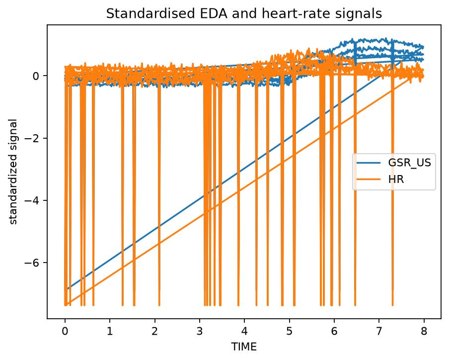
<figcaption><strong>Biometric signal overview.</strong> Standardised EDA and heart-rate traces from the bundled kiosk demonstration.</figcaption>
</figure>
<figure>
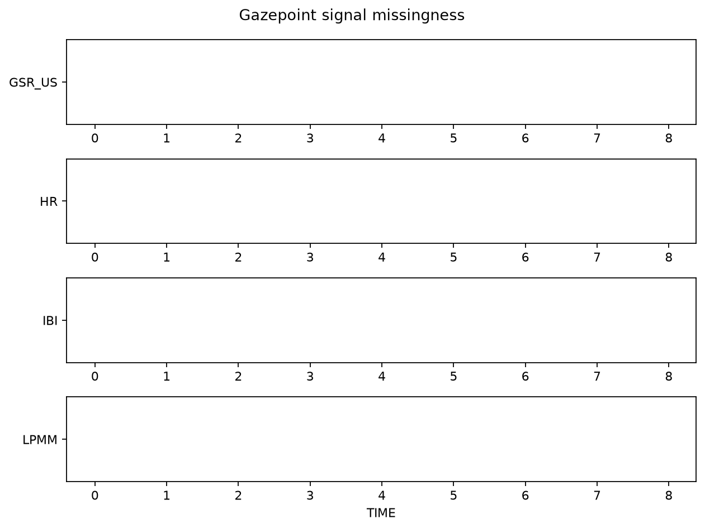
<figcaption><strong>Missingness overview.</strong> Channel-level availability across EDA, heart-rate, IBI and pupil measurements.</figcaption>
</figure>
<figure>
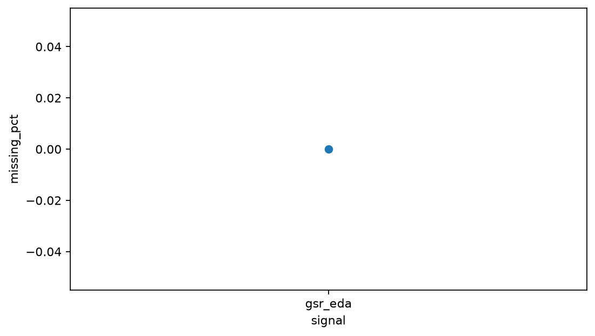
<figcaption><strong>Signal-quality diagnostic.</strong> A compact core-QC summary suitable for preprocessing review.</figcaption>
</figure>
<figure>
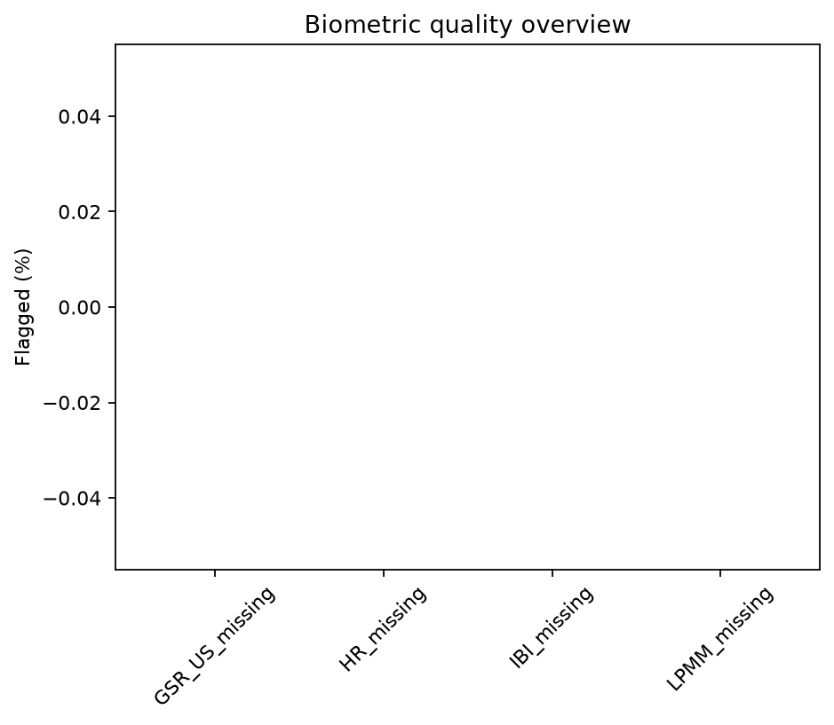
<figcaption><strong>Biometric quality overview.</strong> A broader multi-channel view for manual QC and reporting.</figcaption>
</figure>
</div>

<div class="gp-gallery-next">Continue with the <a href="../examples/quality-reporting/">quality and reporting example</a> or the <a href="../guides/validate-dataset/">dataset validation guide</a>.</div>

## EDA and SCR

<div class="gp-gallery">
<figure>
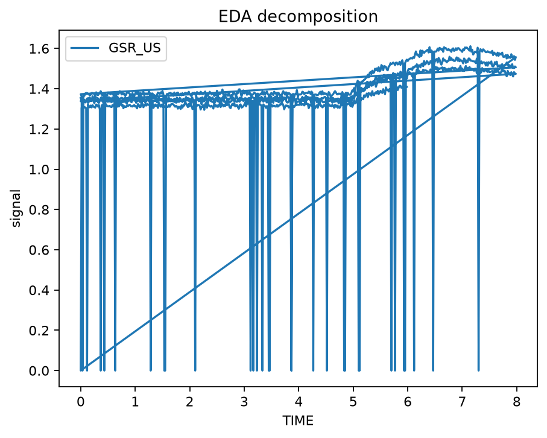
<figcaption><strong>EDA decomposition.</strong> Observed signal with tonic and phasic components.</figcaption>
</figure>
<figure>
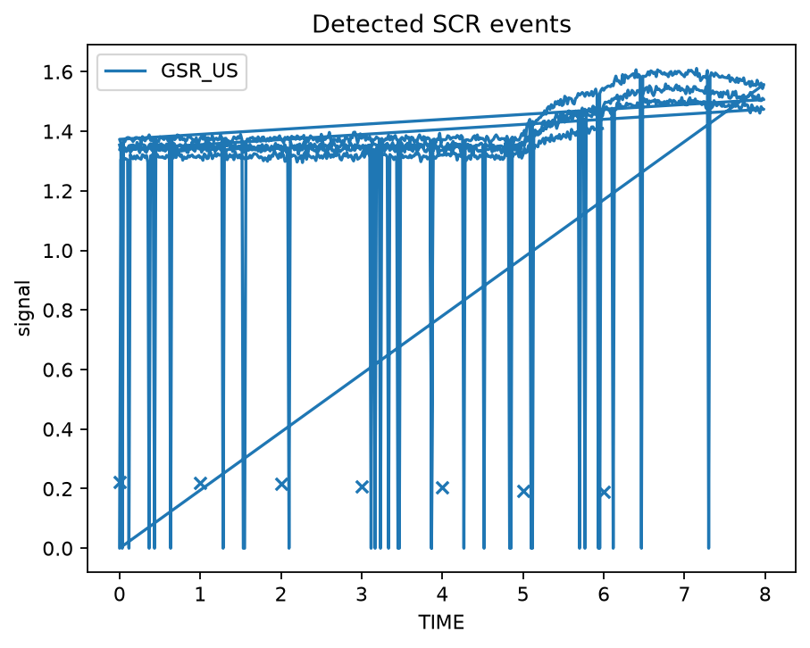
<figcaption><strong>SCR events.</strong> Deterministically detected skin-conductance responses over the EDA trace.</figcaption>
</figure>
<figure>
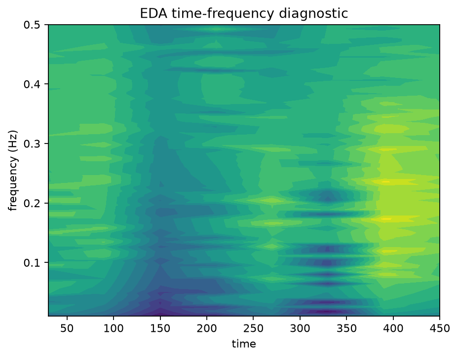
<figcaption><strong>EDA-gram.</strong> Time-frequency diagnostic for slow electrodermal dynamics.</figcaption>
</figure>
</div>

<div class="gp-gallery-next">See the <a href="../examples/eda-scr/">EDA / SCR example</a> for preprocessing, event detection, QC, and reporting context.</div>

## PPG and HRV

<div class="gp-gallery">
<figure>
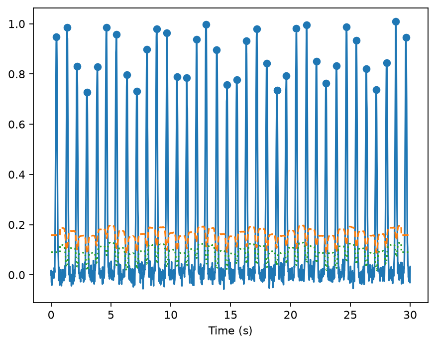
<figcaption><strong>PPG peak detection.</strong> Pulse waveform and accepted peaks from the deterministic synthetic generator.</figcaption>
</figure>
<figure>
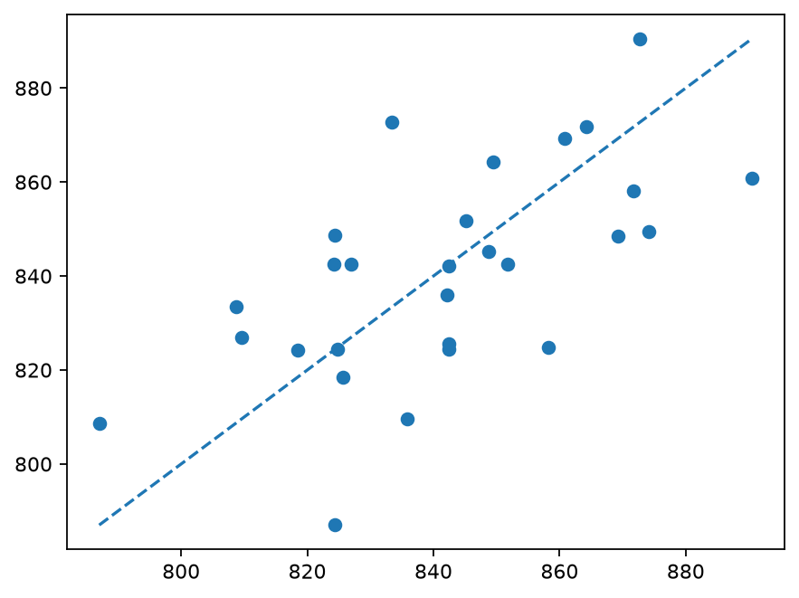
<figcaption><strong>Poincaré plot.</strong> Beat-to-beat geometry for interval-variability inspection.</figcaption>
</figure>
<figure>
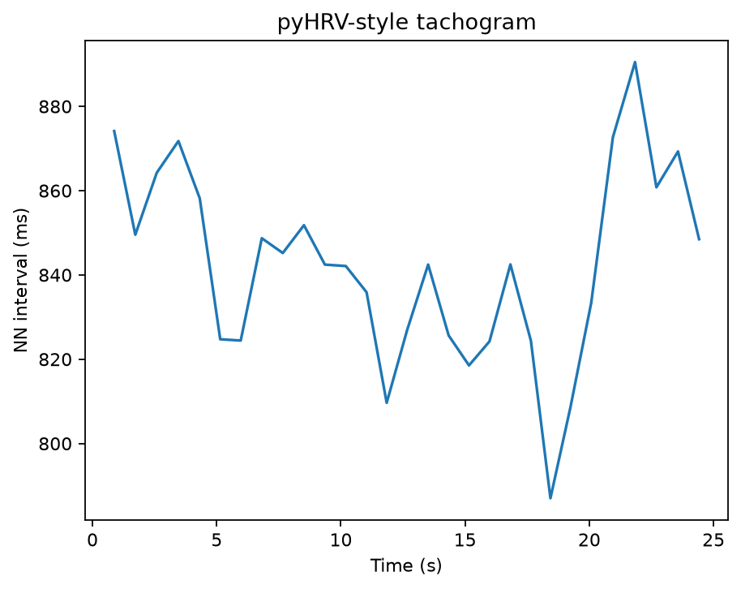
<figcaption><strong>HRV/PRV-style tachogram.</strong> Beat-to-beat interval trajectory through the pyHRV-style visual interface; scientific naming still depends on source provenance.</figcaption>
</figure>
</div>

<div class="gp-gallery-next">Use the <a href="../examples/ppg-hrv/">PPG / HRV example</a> to keep peak detection, interval provenance, and HRV-versus-PRV interpretation explicit.</div>

### PPG measurement equity — new in 0.1.8

The following three SVG figures are generated by the deterministic PPG measurement-equity example. They deliberately separate waveform properties, candidate-value availability, and reference error.

<div class="gp-gallery">
<figure>

<figcaption><strong>Raw waveform / SQI evidence.</strong> Acquisition-level differences are inspected before downstream agreement claims.</figcaption>
</figure>
<figure>

<figcaption><strong>Retention over ITA.</strong> The known-truth generator makes candidate-HR availability vary across the observed objective-pigmentation range.</figcaption>
</figure>
<figure>

<figcaption><strong>Reference error over ITA.</strong> The synthetic HR-error mechanism remains ITA-neutral even while availability changes.</figcaption>
</figure>
</div>

<div class="gp-gallery-next">Follow the <a href="../examples/ppg-equity-synthetic/">PPG measurement-equity synthetic example</a>, read <a href="../articles/python-native/ppg-measurement-equity/">Auditing PPG measurement equity</a>, or inspect the <a href="../ppg-equity-external-evidence/">authorized STEP external-evidence record</a>.</div>

## Pupil, gaze and AOIs

<div class="gp-gallery">
<figure>
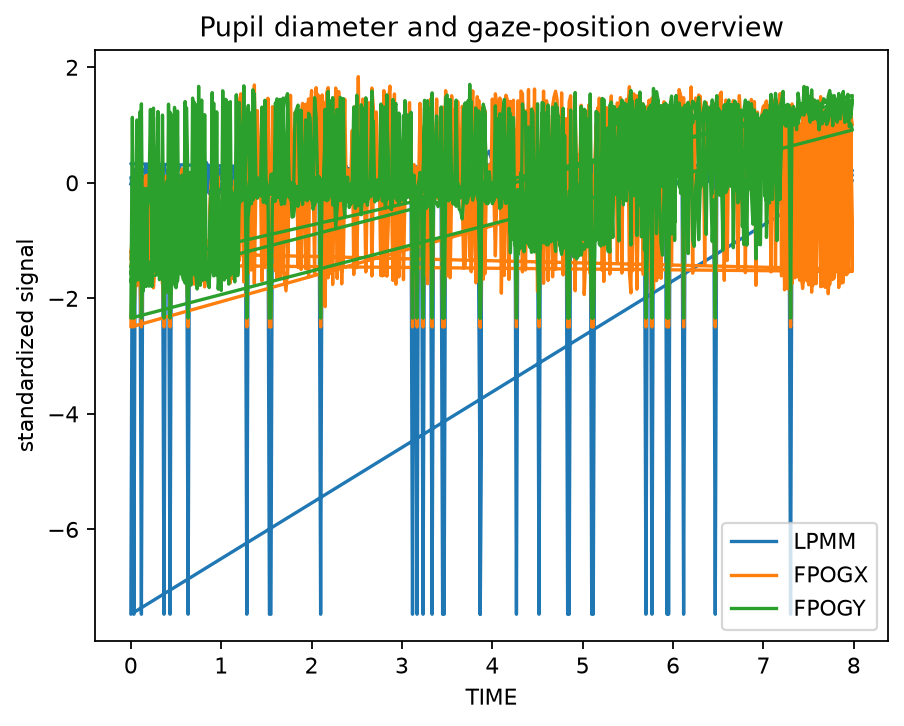
<figcaption><strong>Pupil and gaze overview.</strong> Standardised pupil diameter and gaze coordinates for one synthetic participant.</figcaption>
</figure>
<figure>
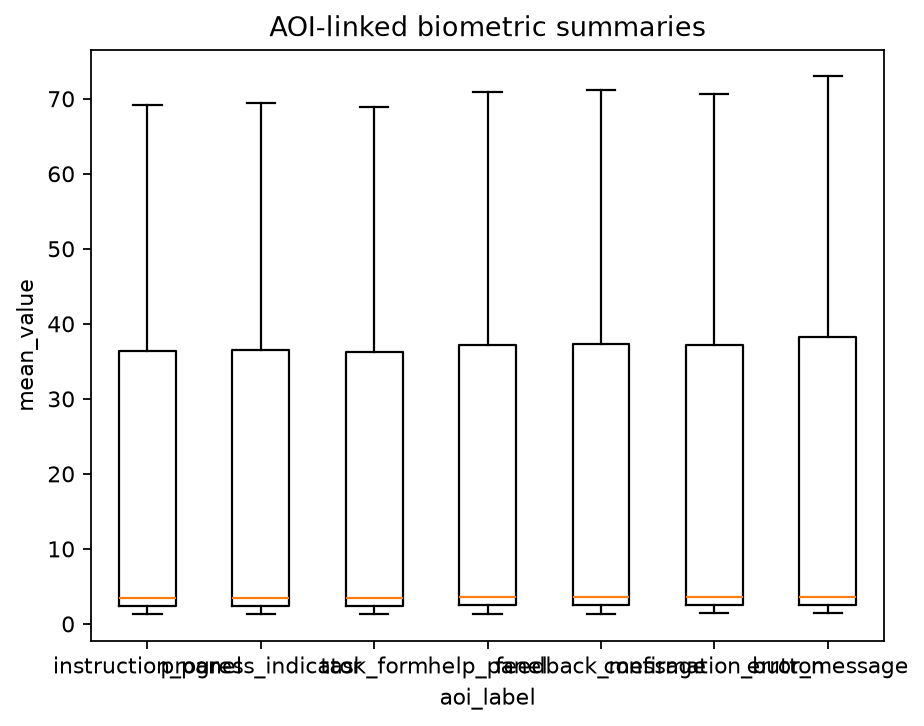
<figcaption><strong>AOI-linked biometrics.</strong> EDA, heart-rate and pupil summaries grouped by areas of interest.</figcaption>
</figure>
<figure>
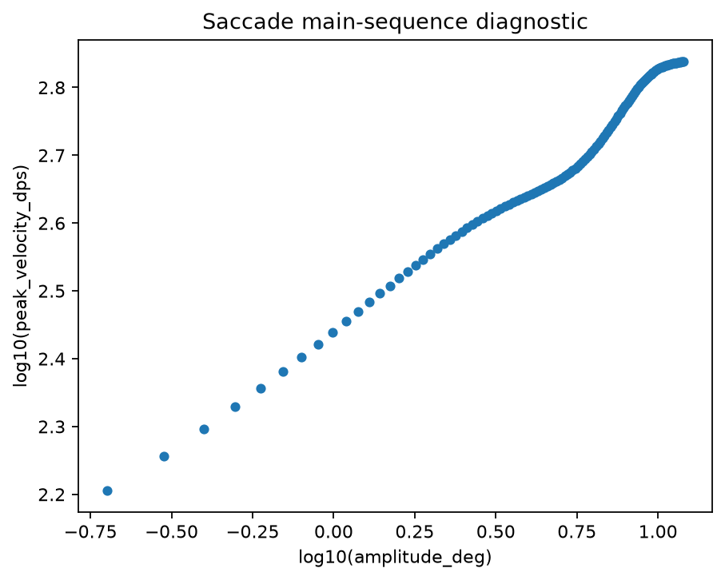
<figcaption><strong>Saccade main sequence.</strong> Amplitude/peak-velocity relationship used as a gaze-event diagnostic.</figcaption>
</figure>
</div>

<div class="gp-gallery-next">Continue with the <a href="../examples/pupil-gaze/">pupil, gaze and AOI example</a> for validity, event, AOI, and pupil-specific checks.</div>

## Multimodal alignment

<div class="gp-gallery">
<figure>
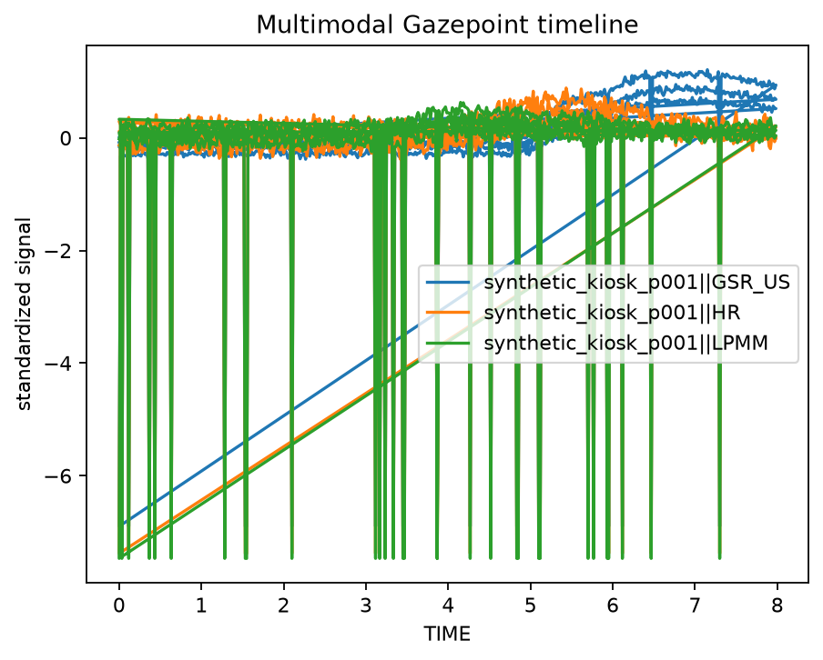
<figcaption><strong>Multimodal timeline.</strong> Synchronous EDA, heart-rate and pupil channels with event markers on the demonstration timebase.</figcaption>
</figure>
</div>

<div class="gp-gallery-next">The <a href="../examples/multimodal/">multimodal example</a> and <a href="../guides/timebase-alignment/">timebase guide</a> separate coordinate alignment from evidence about actual hardware synchronization.</div>

## Design and inference

<div class="gp-gallery">
<figure>
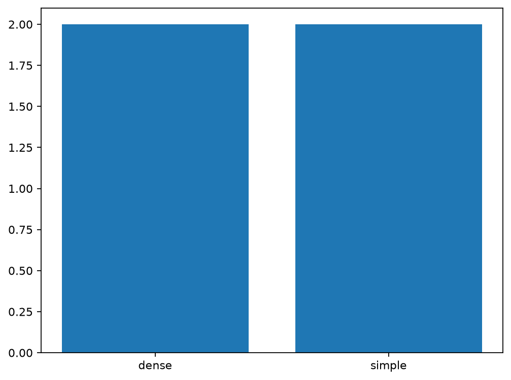
<figcaption><strong>Design coverage.</strong> Condition/trial coverage inspected before modelling so sparse or imbalanced cells remain visible.</figcaption>
</figure>
<figure>
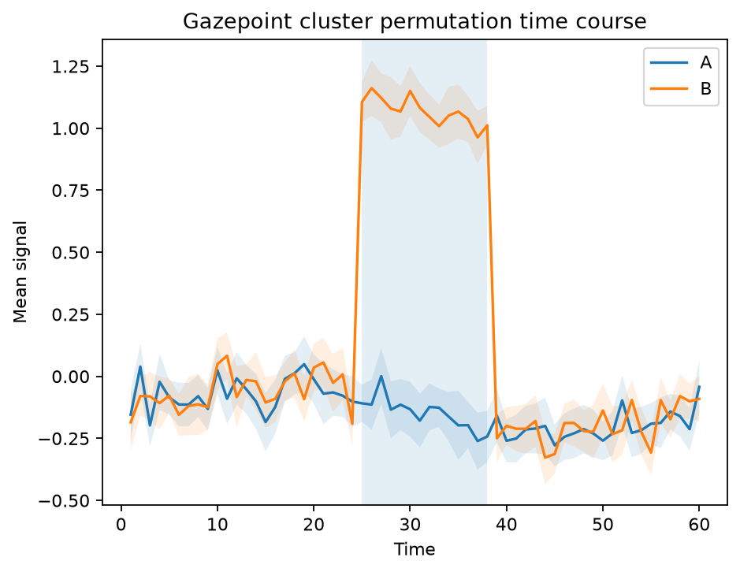
<figcaption><strong>Cluster-permutation time course.</strong> A deterministic synthetic two-condition effect with detected cluster information. Cluster timing is descriptive rather than precise onset evidence.</figcaption>
</figure>
<figure>
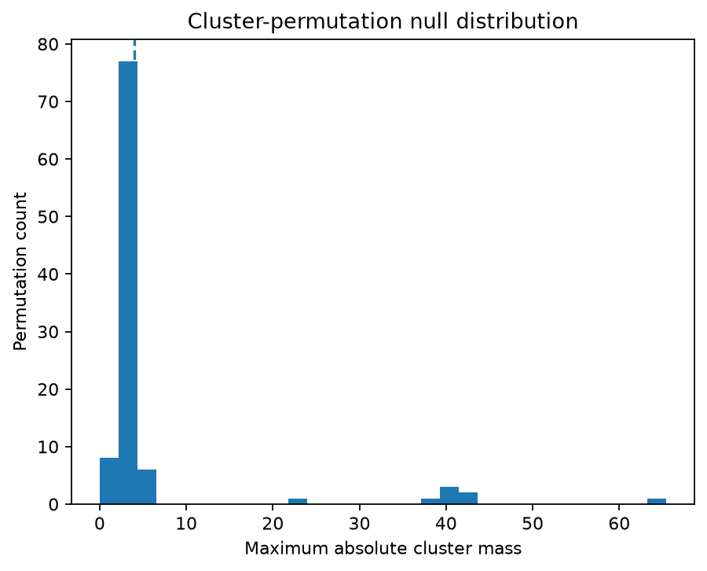
<figcaption><strong>Cluster null distribution.</strong> The global permutation reference distribution used by the synthetic cluster example.</figcaption>
</figure>
</div>

<div class="gp-gallery-next">For model choice, use the <a href="../guides/model-selection/">modelling strategy guide</a>; for process-data inference, read the relevant <a href="../methods/">method notes</a> before interpreting timing or heterogeneity.</div>

## Read the figures as diagnostics

The gallery is designed to make intermediate evidence visible. A diagnostic plot is not a scientific conclusion by itself:

- missingness and quality plots document recorded-data properties;
- decomposition and peak plots document transformations and detection behavior;
- PPG measurement-equity figures keep acquisition quality, availability, and error distinct;
- gaze plots document measured or derived eye-tracking behavior;
- design plots document coverage;
- cluster plots summarize an inferential procedure under its stated exchangeability assumptions;
- multimodal plots show aligned coordinates but do not prove hardware synchronization.

## Where the code lives

The 17 core PNGs are generated from public package functions by `scripts/generate_docs_gallery.py`. The three PPG measurement-equity SVGs are generated by `scripts/generate_ppg_equity_synthetic_demo.py`. See the [domain examples](examples/index.md), the [26 executable frozen R-companion articles](articles/index.md), the [Python-native explanation articles](articles/python-native/index.md), and the [406-function API reference](api/reference.md) for corresponding code and workflow context.
