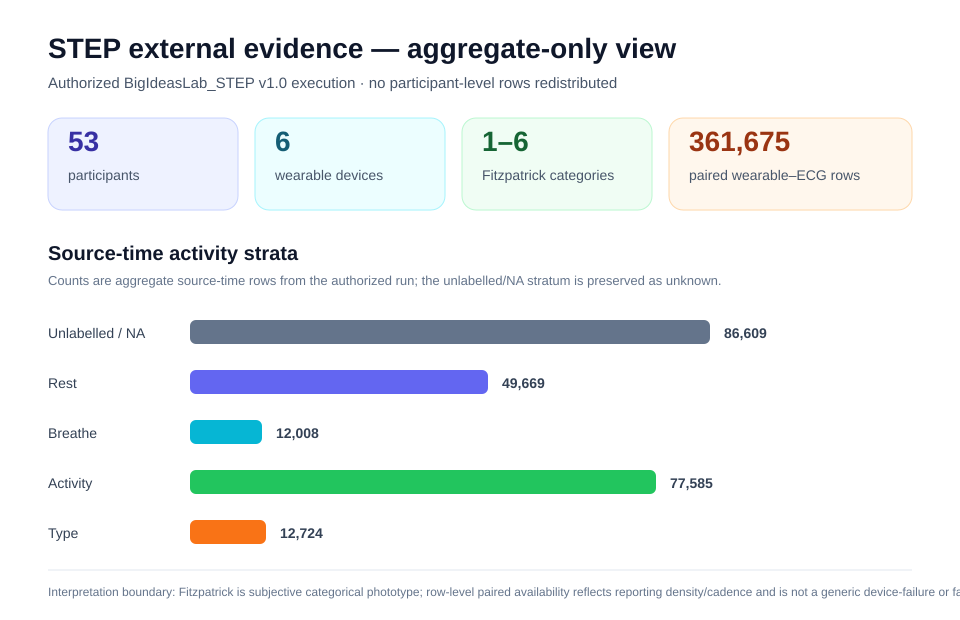

# gpbiometricspy 0.1.8 — PPG measurement equity and STEP evidence

Published **2026-10-04**.

`gpbiometricspy 0.1.8` preserves the frozen **406/406** `gpbiometrics 2.0.0` semantic contract with **0 pending exports** while promoting the post-0.1.7 PPG pigmentation / measurement-equity programme into the stable release scope.

<div class="gp-actions">
<a class="md-button md-button--primary" href="articles/python-native/ppg-measurement-equity/">Read the PPG measurement-equity article</a>
<a class="md-button" href="examples/ppg-equity-synthetic/">Run the synthetic example</a>
<a class="md-button" href="plot-gallery/">View the 0.1.8 figures</a>
<a class="md-button" href="ppg-equity-external-evidence/">Inspect STEP evidence</a>
</div>

## Exact release source and qualification

The immutable `v0.1.8` tag and public release artifacts resolve to exact stable source:

```text
32cafd5565bdf4a7575dcf5c5d6bb2bfbe101e5d
```

The scientific qualification baseline immediately before the stable freeze was `a75eb1d73791213e6e830ff94975f632455632e2`. The merged 0.1.8 source then passed the complete protected exact-main release gate set before the immutable tag and public artifacts were created.

- **12/12** OS × Python 3.11–3.14 test lanes green;
- **874/874** tests;
- **15,612/15,612 statements = 100.00%**;
- **7,315/7,334 raw branches = 99.7409%**;
- exactly **19** reviewed structural arcs;
- **0 unexpected / 0 stale / 0 unaudited** branch debt;
- **7,334/7,334 = 100.0000%** audited branch accounting;
- docs/Pages, CodeQL, deep parity, interoperability, private real-data validation and release-handoff safety green;
- Windows install/repair/upgrade/downgrade release-policy proof green;
- canonical GitHub Release and PyPI Trusted Publishing completed successfully.

## Public release artifacts

- GitHub Release: [`v0.1.8`](https://github.com/stefanosbalaskas/gpbiometricspy/releases/tag/v0.1.8)
- PyPI: [`gpbiometricspy 0.1.8`](https://pypi.org/project/gpbiometricspy/0.1.8/)
- wheel SHA-256: `b1a88c2306843df2cc324b8987335bba413d27715a81f451ba0a036afe0a39f0`
- sdist SHA-256: `231c14bab9eeddb0e0e6e9dce0cc095451cf48d7dcd160c5c553005482d7c24d`

PyPI Trusted Publishing generated and uploaded digital attestations for both distributions.

## PPG measurement-equity surface

Version 0.1.8 includes the Python-native functions `compute_skin_ita()`, `validate_skin_pigmentation_metadata()`, `summarize_ppg_quality_by_pigmentation()`, `compare_ppg_reference_by_pigmentation()` and `ppg_pigmentation_audit()`.

The method separates pigmentation provenance, acquisition quality, retention/paired availability, and reference agreement. Objective CIELAB/ITA-style measures can support continuous descriptive associations. Subjective Fitzpatrick/Monk-style scales remain subjective provenance; demographic race/ethnicity proxies are not treated as pigmentation.

The package does not apply a universal pigmentation correction, does not automatically exclude observations because of pigmentation, and does not label a device “fair” or “unfair”.

<div class="gp-gallery">
<figure>

<figcaption><strong>Acquisition quality.</strong> Raw waveform/SQI evidence is retained as a separate analytical layer.</figcaption>
</figure>
<figure>

<figcaption><strong>Availability.</strong> Candidate-HR retention varies across ITA in the known-truth generator.</figcaption>
</figure>
<figure>

<figcaption><strong>Reference agreement.</strong> HR error remains ITA-neutral in the same generator.</figcaption>
</figure>
</div>

See [PPG pigmentation & measurement-equity audit](methods/ppg-pigmentation-equity.md), the [synthetic worked example](examples/ppg-equity-synthetic.md), and the explanation article [Auditing PPG measurement equity](articles/python-native/ppg-measurement-equity.md).

## STEP external evidence

BigIdeasLab_STEP v1.0 was executed on an authorized local copy under the applicable PhysioNet DUA against exact scientific source `dc2b539154f65061a90d360f01503108ad1fd39f`.

The retained aggregate record includes:

- DOI `10.13026/cqfy-d860`;
- 53 participants;
- 1,431,570 long-format wearable rows;
- 1,328,850 rows with ECG reference available;
- 361,675 paired wearable/ECG measurements;
- six wearable devices;
- participant-cluster bootstrap with 1,000 replicates and seed `20261003`;
- derived-only bundle SHA256 `65EF1DE84CF711F9E6753DB771E3E2386FD6926A104E0D4DC1618EE88E8744B1`.



Restricted participant-level rows were not committed or redistributed. The visual above uses only DUA-safe aggregate counts already retained in the public evidence record.

Fitzpatrick 1–6 is retained as **subjective categorical phototype**, not objective pigmentation. STEP row-level retention is interpreted as **paired availability/reporting density** because device reporting cadence differs materially. The observed unlabeled/NA activity stratum remains unlabeled. Agreement results are observational and device/activity-specific.

See the [external-evidence record](ppg-equity-external-evidence.md).

## Explicit exclusions

0.1.8 does not claim:

- causal effects of pigmentation or melanin on PPG performance;
- race or ethnicity as a substitute for measured pigmentation;
- generic device fairness from paired error statistics;
- a universal pigmentation correction;
- real ENCoDE execution;
- clinical SpO₂/pulse-oximeter validation.

ENCoDE remains deferred future evidence infrastructure.

## Archival state

The software concept DOI remains **10.5281/zenodo.22150872** and the frozen R reference DOI remains **10.5281/zenodo.21434608**. A 0.1.8 version DOI is not claimed until genuine independent Zenodo ingestion is verified.

## Publication state

`gpbiometricspy 0.1.8` is the current public stable release. The immutable `v0.1.8` tag, GitHub Release assets, canonical wheel/sdist hashes, PyPI publication through Trusted Publishing, and digital attestations have all been verified against exact source `32cafd5565bdf4a7575dcf5c5d6bb2bfbe101e5d`.
