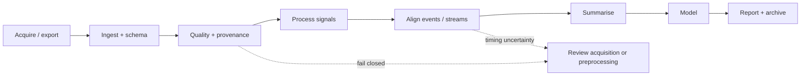

# Start here

Choose the path that matches what you are trying to do. This page is intentionally task-first: it routes new users to a successful first analysis, researchers bringing their own data through a provenance-first onboarding path, experienced users to the right workflow, and reviewers or collaborators to the validation evidence behind the package.

Stable 0.1.6
Development 0.1.7.dev0
406 / 406 frozen exports
Python 3.11–3.14
Synthetic-first examples

## Pick your route

<a class="gp-route-card" href="../guides/first-analysis/">
New user
<h3>Run a complete first analysis</h3>

Install the package, load the bundled synthetic dataset, inspect signals, run QC, create plots, and keep a reproducible record.

</a>

<a class="gp-route-card" data-learning-route="research-project-onboarding" href="../guides/research-project-scaffold/">
New research project
<h3>Set up, define, adapt, validate, then analyze</h3>

Create a reviewable project structure, define field roles/units/clocks and event semantics, preserve and map your own export, verify measurement evidence, then enter the modality-specific workflow.

</a>

<a class="gp-route-card" data-learning-route="study-metadata-dictionary" href="../guides/study-metadata-data-dictionary/">
Study contract
<h3>Define variables, clocks and events explicitly</h3>

Create a reviewable metadata and data-dictionary contract that separates observed file properties from researcher-declared roles, units, provenance and event meaning.

</a>

<a class="gp-route-card" href="../workflows/">
Research workflow
<h3>Start from the data you recorded</h3>

Choose EDA/SCR, PPG/HRV, pupil/gaze/AOI, multimodal alignment, QC/reporting, or interoperability and follow the shortest defensible path.

</a>

<a class="gp-route-card" href="../studio/">
Visual workflow
<h3>Use gpbiometricspy Studio</h3>

Work through project, quality, analysis, alignment, summarisation, modelling, and reporting in a guided application backed by the same scientific package functions.

</a>

<a class="gp-route-card" href="../guides/bring-your-own-export/">
Existing export
<h3>Adapt an unfamiliar file safely</h3>

Keep the original source intact, preview source-to-standard mappings, verify time and event assumptions, and retain an adaptation manifest before analysis.

</a>

<a class="gp-route-card" href="../guides/model-selection/">
Statistics
<h3>Choose a modelling strategy</h3>

Compare grouped predictive models with hierarchical location–scale families, robust variants, random slopes, and crossed participant–item structures.

</a>

<a class="gp-route-card" href="../parity/">
Reviewer / auditor
<h3>Inspect validation and scientific boundaries</h3>

Trace frozen R parity, deep validation, private real-data smoke testing, measurement accountability, and explicit interpretation guardrails.

</a>

## Bringing your own research data

<strong>1 · Project</strong>Create the <a href="../guides/research-project-scaffold/">research project scaffold</a> so source data, mappings, QC, events, derived outputs, models and reports remain distinct.

<strong>2 · Define</strong>Use <a href="../guides/study-metadata-data-dictionary/">Study metadata and data dictionary</a> to declare variable roles, units, clock ownership, identifiers, provenance and event semantics without guessing from labels.

<strong>3 · Adapt</strong>Use <a href="../guides/bring-your-own-export/">Bring your own export safely</a> to preserve source names, inspect mappings and record adaptation evidence.

<strong>4 · Validate</strong>Run <a href="../guides/validate-dataset/">new-dataset validation</a> for schema, timing, signal activity, missingness, resets, provenance and event coverage.

<strong>5 · Analyze</strong>Choose the relevant <a href="../workflows/">signal workflow</a> or follow the <a href="../guides/hands-on-eda-research/">complete hands-on analysis</a> once the required evidence is defensible.

<strong>Do not collapse these stages.</strong> A familiar column label is not a scientific definition; standardising a name is not validation; a present channel is not necessarily active; a parsed timestamp does not establish its unit or clock; and a successful model does not repair uncertain measurement provenance.

!!! note "One scientific engine, several interfaces"
    Studio, the Python API, executable tutorials, generated figures, and documentation examples all point back to the same package implementation. The visual application is not a second statistical codebase.

## The research path in one view

The same seven stages organize the homepage, Start Here, Studio, workflows, and downstream API discovery.

<strong>01</strong>Project<small>Import or generate data and identify channels.</small>

<strong>02</strong>Quality<small>Check schema, validity, missingness and provenance.</small>

<strong>03</strong>Analyze<small>Process recorded signals with domain-appropriate methods.</small>

<strong>04</strong>Align<small>Connect events, clocks, streams and experimental structure.</small>

<strong>05</strong>Summarise<small>Derive analysis-ready features while retaining QC context.</small>

<strong>06</strong>Model<small>Choose guarded statistics that match the study design.</small>

<strong>07</strong>Report<small>Export results, diagnostics, provenance and replay information.</small>

<strong>Default rule:</strong> do not move downstream merely because a function returns a result. Move downstream when the evidence needed for the next scientific claim has been checked and retained.

## What should I read next?

| Goal | Best next page | Why |
|---|---|---|
| Set up a new research project | [Research project scaffold](guides/research-project-scaffold.md) | Separates source data, mappings, QC, events, derived outputs, models and reports before analysis begins. |
| Define variable roles, units, clocks and event semantics | [Study metadata and data dictionary](guides/study-metadata-data-dictionary.md) | Creates a reviewable measurement contract before column standardisation and analysis code depend on field meaning. |
| Adapt an unfamiliar export | [Bring your own export safely](guides/bring-your-own-export.md) | Preserves source semantics and records mapping, schema, timing and event evidence before standardisation. |
| Learn by doing | [First analysis](guides/first-analysis.md) | A short successful path using bundled synthetic data. |
| Work with a specific signal | [Workflow map](workflows.md) | Routes by EDA, PPG/HRV, pupil/gaze, events, or external tools. |
| See outputs before reading code | [Plot gallery](plot-gallery.md) | Generated figures from the package's plotting surface. |
| Understand the design philosophy | [Research pipeline blueprint](articles/python-native/research-pipeline-blueprint.md) | Explains why QC, provenance, processing, modelling, and reporting are separate layers. |
| Find a function | [API browser](api/index.md) | Domain-organized entry point to the complete 406-function reference. |
| Choose a hierarchical model | [Modelling strategy guide](guides/model-selection.md) | Compares the current Python-native modelling families and their boundaries. |
| Prepare a paper or supplement | [Reporting and reproducibility](guides/reporting-reproducibility.md) | Lists the evidence worth retaining and reporting. |

## Three principles that prevent most workflow mistakes

1 · Measurement
<h3>Validate before transforming</h3>

Sampling rate, timebase, missingness, interval identity, event coverage, and source provenance constrain what later analyses can mean.

2 · Design
<h3>Respect the unit of generalisation</h3>

Repeated observations, participants, items, trials, and unseen groups require different validation splits and different model semantics.

3 · Reporting
<h3>Keep the evidence trail</h3>

Retain QC outputs, settings, software versions, plots, exclusions, timing evidence, and model certificates rather than only a final feature table.

## Scientific boundary

The package measures, processes, audits, aligns, summarises, predicts, and models recorded signals. Those operations do not by themselves establish emotion, stress, trust, preference, cognition, diagnosis, sensor validity, reliability, or causal effects. Use the interpretation supported by the study design and measurement evidence, not the label of a software function.

