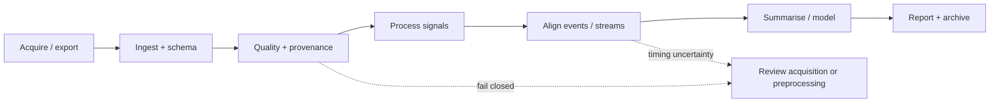

# Start here

Choose the path that matches what you are trying to do. This page is intentionally task-first: it routes new users to a successful first analysis, experienced researchers to the right workflow, and reviewers or collaborators to the validation evidence behind the package.

Stable 0.1.6
Development 0.1.7.dev0
406 / 406 frozen exports
Python 3.11–3.14
Synthetic-first examples

## Pick your route

<a class="gp-route-card" href="guides/first-analysis/">
New user
<h3>Run a complete first analysis</h3>

Install the package, load the bundled synthetic dataset, inspect signals, run QC, create plots, and keep a reproducible record.

</a>

<a class="gp-route-card" href="workflows/">
Research workflow
<h3>Start from the data you recorded</h3>

Choose EDA/SCR, PPG/HRV, pupil/gaze/AOI, multimodal alignment, QC/reporting, or interoperability and follow the shortest defensible path.

</a>

<a class="gp-route-card" href="studio/">
Visual workflow
<h3>Use gpbiometricspy Studio</h3>

Work through project, quality, analysis, alignment, modelling, and reporting in a guided application backed by the same scientific package functions.

</a>

<a class="gp-route-card" href="guides/validate-dataset/">
Bring your own data
<h3>Validate a new dataset before analysis</h3>

Check schema, sampling, missingness, resets, source provenance, event structure, and cross-stream timing before deriving substantive results.

</a>

<a class="gp-route-card" href="guides/model-selection/">
Statistics
<h3>Choose a modelling strategy</h3>

Compare grouped predictive models with hierarchical location–scale families, robust variants, random slopes, and crossed participant–item structures.

</a>

<a class="gp-route-card" href="parity/">
Reviewer / auditor
<h3>Inspect validation and scientific boundaries</h3>

Trace frozen R parity, deep validation, private real-data smoke testing, measurement accountability, and explicit interpretation guardrails.

</a>

!!! note "One scientific engine, several interfaces"
    Studio, the Python API, executable tutorials, generated figures, and documentation examples all point back to the same package implementation. The visual application is not a second statistical codebase.

## The research path in one view

<strong>Default rule:</strong> do not move downstream merely because a function returns a result. Move downstream when the evidence needed for the next scientific claim has been checked and retained.

## What should I read next?

| Goal | Best next page | Why |
|---|---|---|
| Learn by doing | [First analysis](guides/first-analysis.md) | A short successful path using bundled synthetic data. |
| Work with a specific signal | [Workflow map](workflows.md) | Routes by EDA, PPG/HRV, pupil/gaze, events, or external tools. |
| See outputs before reading code | [Plot gallery](plot-gallery.md) | Generated figures from the package's plotting surface. |
| Understand the design philosophy | [Research pipeline blueprint](articles/python-native/research-pipeline-blueprint.md) | Explains why QC, provenance, processing, modelling, and reporting are separate layers. |
| Find a function | [API browser](api/index.md) | Domain-organized entry point to the complete 406-function reference. |
| Choose a hierarchical model | [Modelling strategy guide](guides/model-selection.md) | Compares the current Python-native modelling families and their boundaries. |
| Prepare a paper or supplement | [Reporting and reproducibility](guides/reporting-reproducibility.md) | Lists the evidence worth retaining and reporting. |

## Three principles that prevent most workflow mistakes

1 · Measurement
<h3>Validate before transforming</h3>

Sampling rate, timebase, missingness, interval identity, event coverage, and source provenance constrain what later analyses can mean.

2 · Design
<h3>Respect the unit of generalisation</h3>

Repeated observations, participants, items, trials, and unseen groups require different validation splits and different model semantics.

3 · Reporting
<h3>Keep the evidence trail</h3>

Retain QC outputs, settings, software versions, plots, exclusions, timing evidence, and model certificates rather than only a final feature table.

## Scientific boundary

The package measures, processes, audits, aligns, summarises, predicts, and models recorded signals. Those operations do not by themselves establish emotion, stress, trust, preference, cognition, diagnosis, sensor validity, or causal effects. Use the interpretation supported by the study design and measurement evidence, not the label of a software function.

