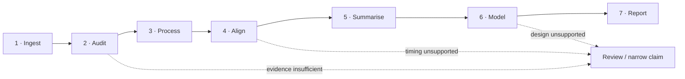

# Workflow map

Use this page as the shortest route from **what you recorded** to **what to do next**. Start from the measurement, establish the evidence needed for the next step, then follow the domain-specific example or article.

A workflow is complete only when its measurement assumptions, QC, timing, transformations, analysis settings, and reporting evidence remain traceable—not merely when it produces a final feature table.

## Choose by recorded data

| You have | Establish first | Typical next steps | Go to |
|---|---|---|---|
| EDA / GSR | units, activity, missingness, timing | tonic/phasic decomposition, SCR detection, event summaries | [EDA / GSR / SCR](examples/eda-scr.md) |
| PPG waveform | source + observed sampling + pulse quality | peak detection, intervals, PRV/HRV-ready diagnostics | [PPG / HRV](examples/ppg-hrv.md) |
| IBI / RR / NN intervals | source identity, units, cleaning status | time/frequency/nonlinear variability, agreement checks | [PPG / HRV](examples/ppg-hrv.md) |
| Pupil diameter | eye/channel, validity, blinks, timing | baseline/change summaries, event windows, AOI linkage | [Pupil / gaze / AOI](examples/pupil-gaze.md) |
| Gaze coordinates / fixations | coordinate space, validity, event source, timebase | AOIs, transitions, saccades, linked physiology | [Pupil / gaze / AOI](examples/pupil-gaze.md) |
| TTL / event markers | event identity, edge semantics, clock | trial windows, event locking, cross-stream alignment | [Multimodal alignment](examples/multimodal.md) |
| Multiple streams | clock identity + overlap + anchors | offset/drift correction, alignment, windowed features | [Timebase guide](guides/timebase-alignment.md) |
| External neuro/physiology files | backend/version + exchange semantics | MNE, LSL/XDF, BioSPPy, HeartPy, pyHRV, NeuroKit bridges | [Interoperability](examples/interoperability.md) |
| Completed analysis | QC evidence + software identity + settings | visual audit, reproducibility, interpretation guardrails | [QC + reporting](examples/quality-reporting.md) |
| Repeated/crossed outcome data | grouping structure + prediction target | grouped prediction or hierarchical location–scale modelling | [Model selection](guides/model-selection.md) |

## Recommended research pipeline

<strong>01</strong>Ingest<small>Read exports, preserve source identity, standardize schema.</small>

<strong>02</strong>Audit<small>Check timing, missingness, signal activity, events and design.</small>

<strong>03</strong>Process<small>Apply modality-specific transformations with explicit settings.</small>

<strong>04</strong>Align<small>Relate clocks, events, trials, AOIs and secondary streams.</small>

<strong>05</strong>Model<small>Match validation unit and random structure to the scientific target.</small>

<strong>06</strong>Report<small>Retain QC, provenance, plots, software identity and guardrails.</small>

## Three workflow checkpoints

Checkpoint 1<h3>Measurement-ready</h3>
Source identity, units, timebase, channel validity, event coverage, and grouping variables are sufficiently documented for processing.

Checkpoint 2<h3>Analysis-ready</h3>
Transformations are explicit, alignment is defensible, exclusions are traceable, and the model-ready table reflects the intended scientific unit.

Checkpoint 3<h3>Report-ready</h3>
Results are accompanied by QC evidence, settings, figures, versions, prediction semantics, sensitivity checks, and restrained interpretation.

## What makes a workflow complete?

Retain at least:

- raw-to-standardized schema decisions;
- source/provenance declarations where scientific identity matters;
- observed timebase evidence and any clock mapping;
- signal validity, missingness, dropout, and artifact evidence;
- preprocessing/filter/detection settings;
- event, trial, condition, and AOI coverage;
- optional backend/software versions;
- generated figures used for review;
- exclusion decisions with reasons;
- model specification and validation unit;
- final reporting/reproducibility object or evidence bundle.

## Visual workflow evidence

<a class="gp-visual-card" href="plot-gallery/#signal-overview-and-quality">
<strong>Inspect before deriving</strong>Signal overview and quality evidence come before feature extraction.
</a>
<a class="gp-visual-card" href="plot-gallery/#multimodal-alignment">
<strong>Align before windowing</strong>Define event windows only after the relevant timebases are defensible.
</a>

## Cross-toolbox validation

`gpbiometricspy` can work with or prepare workflows for several established ecosystems. These bridges are for **interoperability and cross-checking**, not for silently changing the package's declared analysis contract.

<a href="articles/toolbox-bridges-workflow/">External toolbox bridges</a>
<a href="articles/mne-eeg-lsl-workflow/">MNE / EEG / LSL</a>
<a href="articles/interoperability-version-testing/">Version testing</a>
<a href="integrations/">Integration matrix</a>

## Need a guided path?

- New to the package: [First analysis](guides/first-analysis.md)
- New research dataset: [Validate a new dataset](guides/validate-dataset.md)
- Multiple clocks/streams: [Timebase and alignment](guides/timebase-alignment.md)
- Statistical structure: [Choose a modelling strategy](guides/model-selection.md)
- Paper/supplement preparation: [Reporting and reproducibility](guides/reporting-reproducibility.md)
- Validation evidence: [Parity & validation](parity.md), [Deep validation](deep-validation.md), and [Private real-data validation](real-data-validation.md)
