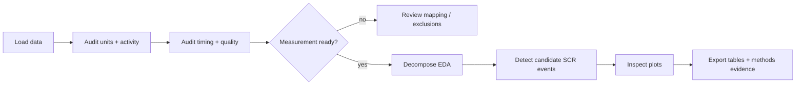

# End-to-end EDA research workflow

<div class="gp-page-intro">
This workflow shows what a defensible `gpbiometricspy` analysis looks like from **input data to report-ready evidence**. It uses the bundled deterministic kiosk demonstration so every step can be reproduced before you substitute a research export.
</div>

!!! tip "Run the complete workflow"
    The repository contains an executable companion at `examples/tutorials/end-to-end-eda-research.py`. It is executed by documentation CI, so the documented path is checked against the package rather than maintained as untested pseudocode.

## The research question this workflow answers

Use this route when you have a continuous GSR/EDA channel and want to obtain **descriptive electrodermal components and candidate SCR-like events** while preserving the evidence needed to review the analysis. The workflow does not infer emotion, stress, preference, deception, diagnosis, or causal psychological response.



## Inputs

The runnable example expects these demonstration columns:

| Column | Role |
|---|---|
| `participant_id` | grouping unit |
| `TIME` | analysis time column |
| `GSR_US` | conductance signal |
| `HR`, `IBI`, `LPMM` | additional channels used only in the initial activity audit |

For your own data, do **not** rename a column merely to make the example run. First establish what the vendor/export column actually measures, its units, its timebase, and whether it is raw or derived.

## Stage 1 — load without destroying provenance

```python
import gpbiometricspy as gp

raw = (
    gp.load_kiosk_demo(participants=["synthetic_kiosk_p001"])
    .copy()
    .iloc[:1800]
    .reset_index(drop=True)
)
```

With a study export, replace only the loading step, for example with the package importer appropriate to your file. Keep the original file name, participant/session identifiers, and untouched source file outside the derived-output directory.

**Output:** one in-memory table plus a traceable reference to the source.

## Stage 2 — establish measurement readiness

Run unit, signal-activity, timing, quality, and artifact audits before decomposition:

```python
groups = ["participant_id"]

units = gp.audit_gazepoint_gsr_units(raw, gsr_col="GSR_US")
activity = gp.audit_gazepoint_signal_activity(
    raw,
    signal_cols=["GSR_US", "HR", "IBI", "LPMM"],
    group_cols=groups,
)
time_resets = gp.audit_gazepoint_time_resets(
    raw,
    time_col="TIME",
    group_cols=groups,
)
quality = gp.audit_gazepoint_gsr_quality(raw, value_column="GSR_US")
artifacts = gp.audit_gazepoint_eda_artifacts(
    raw,
    signal_col="GSR_US",
    time_col="TIME",
    group_cols=groups,
)
```

### Continue only when you can justify

- what `GSR_US` represents and in which units;
- that the signal is present and sufficiently variable for the intended descriptive analysis;
- which clock/time column is being used;
- whether resets, large gaps, missingness, flatline periods, or artifacts require exclusion or segmentation;
- which participant/session grouping defines an independent recording unit.

If these points are unresolved, the correct next step is **review**, not feature extraction.

## Stage 3 — create explicit tonic and phasic components

```python
decomposition = gp.decompose_gazepoint_eda(
    raw,
    signal_col="GSR_US",
    time_col="TIME",
    group_cols=groups,
    window_size=31,
    output_prefix="eda",
)
```

This produces `eda_tonic` and `eda_phasic` columns. The package's deterministic decomposition is a transparent descriptive workflow. For confirmatory electrodermal decomposition where a specialised method is scientifically required, use or cross-check an appropriate biosignal toolbox and report that choice.

**Output:** original rows plus explicit decomposition columns and stored settings/overview metadata.

## Stage 4 — detect candidate SCR-like events

```python
scr = gp.detect_gazepoint_scr_events(
    decomposition,
    phasic_col="eda_phasic",
    signal_col="GSR_US",
    time_col="TIME",
    group_cols=groups,
    threshold=None,
    min_peak_distance=10,
)
```

With `threshold=None`, the detector derives a local threshold from the phasic signal. The returned object includes an overview, an `events` table, a group summary, and the settings used.

Treat these as **candidate waveform events**, not direct psychological labels.

## Stage 5 — inspect the evidence visually

```python
decomposition_plot = gp.plot_gazepoint_eda_decomposition(
    decomposition,
    time_col="TIME",
    signal_cols=["GSR_US", "eda_tonic", "eda_phasic"],
    group_cols=groups,
    title="Observed, tonic and phasic EDA",
)

scr_plot = gp.plot_gazepoint_scr_events(
    decomposition,
    scr["events"],
    time_col="TIME",
    signal_col="GSR_US",
    phasic_col="eda_phasic",
    group_cols=groups,
    title="Candidate SCR events",
)
```

<div class="gp-visual-grid">
<a class="gp-visual-card" href="../../plot-gallery/#eda-and-scr"><div class="gp-visual-card-body"><strong>Decomposition</strong><span>Inspect the intermediate signal representation before interpreting event summaries.</span></div></a>
<a class="gp-visual-card" href="../../plot-gallery/#eda-and-scr"><div class="gp-visual-card-body"><strong>Candidate events</strong><span>Check event placement against the waveform and declared detector settings.</span></div></a>
</div>

A plot is a diagnostic record, not decoration. Retain it with the output used for analysis.

## Stage 6 — produce reporting evidence

```python
checklist = gp.create_gazepoint_biometrics_checklist(raw)
methods_text = gp.create_gazepoint_biometrics_methods_text(checklist=checklist)
```

The checklist exposes active channels, missingness and basic quality evidence. The methods-text helper provides a reproducible starting point; it does **not** replace study-specific reporting of sampling, exclusions, preprocessing settings, experimental timing, or statistical analysis.

## Stage 7 — export a reviewable analysis bundle

Run the checked example from the repository root:

=== "macOS / Linux"

    ```bash
    GPBIOMETRICSPY_TUTORIAL_OUTPUT_DIR=outputs/eda-research \
      python examples/tutorials/end-to-end-eda-research.py
    ```

=== "PowerShell"

    ```powershell
    $env:GPBIOMETRICSPY_TUTORIAL_OUTPUT_DIR = "outputs/eda-research"
    python examples/tutorials/end-to-end-eda-research.py
    ```

The example writes:

```text
outputs/eda-research/
├── eda_decomposition.csv
├── scr_events.csv
├── scr_group_summary.csv
├── analysis_checklist_overview.csv
├── methods_text.txt
├── end-to-end-eda-research-01.png
└── end-to-end-eda-research-02.png
```

The console also emits a small JSON `PASS` record describing the objects produced. This same executable is run by the documentation validator.

## Replace the demonstration with your own export

Change the workflow in this order:

1. **Input mapping:** load your file and identify participant/session, time, and EDA columns.
2. **Unit/time audit:** verify units and observed timing before changing detector settings.
3. **QC rule:** define exclusions or segmentation rules before inspecting condition effects.
4. **Decomposition:** justify the method and window/settings for the scientific purpose.
5. **Event definition:** predeclare threshold/window rules when event counts are inferentially important.
6. **Experimental alignment:** only add stimulus-locked windows after clocks and event markers are defensible.
7. **Statistics:** aggregate/model at the unit implied by the design; do not treat time samples as independent participants.
8. **Reporting:** retain package version, source identity, settings, QC tables, exclusions, plots and analysis outputs.

## Completion criteria

A workflow is report-ready when another researcher can determine:

- what was measured;
- which rows/participants were retained and why;
- which timebase was used;
- which transformation and event settings were applied;
- what the derived event table represents;
- which plots were inspected;
- which package/version produced the output;
- which claims are descriptive versus inferential.

<div class="gp-science-boundary">
The workflow detects and summarizes electrodermal waveform features. It does not establish emotion, stress, cognitive state, preference, deception, health status, diagnosis, or a causal effect of a stimulus. Those claims require an appropriate experimental design, measurement model, and inferential analysis beyond the signal-processing output itself.
</div>

## Continue

- [Hands-on EDA research guide](../guides/hands-on-eda-research.md) — detailed teaching version of every step.
- [Runnable end-to-end example](../examples/end-to-end-eda.md) — shortest copy-paste route.
- [Validate a new dataset](../guides/validate-dataset.md) — use before substituting private study data.
- [Reporting and reproducibility](../guides/reporting-reproducibility.md) — publication-oriented evidence checklist.
