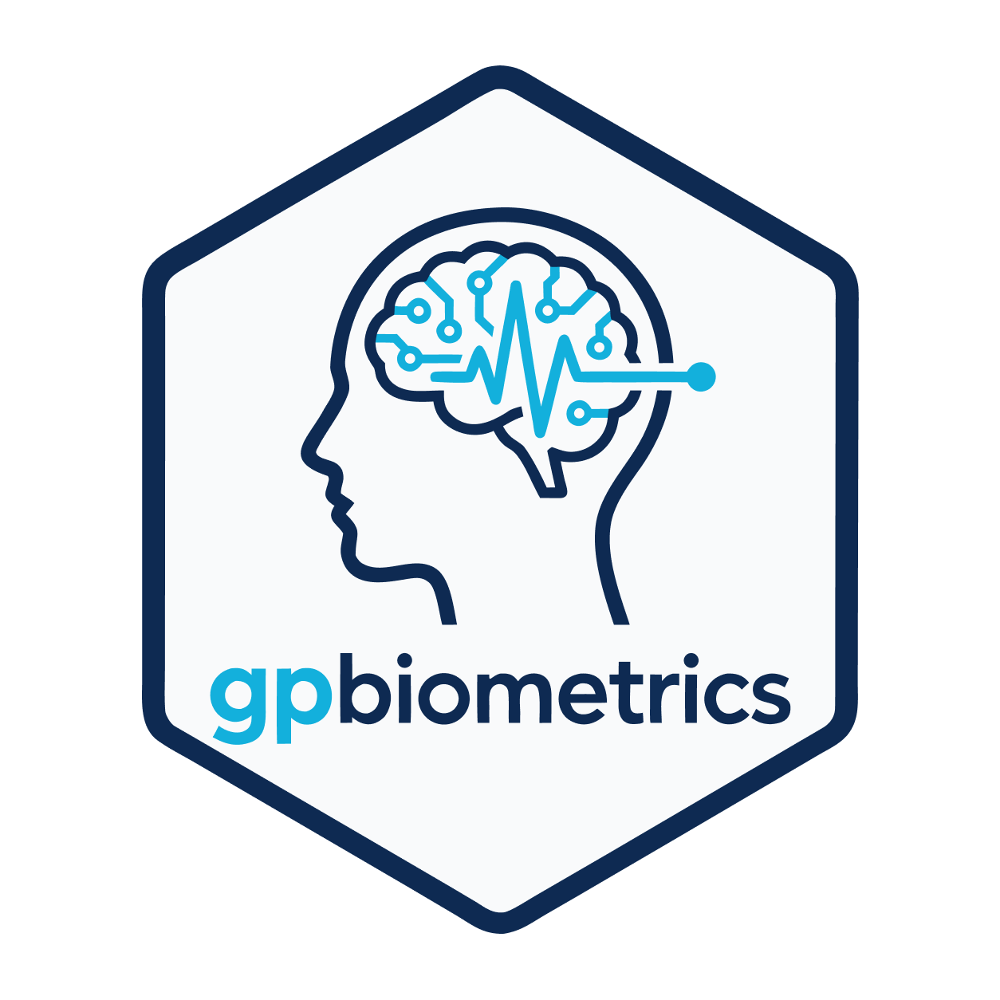

# gpbiometrics 

[](https://lifecycle.r-lib.org/articles/stages.html#maturing)
[](https://github.com/stefanosbalaskas/gpbiometrics/releases/tag/v0.3.0)

[](https://github.com/stefanosbalaskas/gpbiometrics/actions/workflows/R-CMD-check.yaml)
[](https://r-pkg.org/pkg/gpbiometrics)
[](https://doi.org/10.5281/zenodo.20836724)

`gpbiometrics` provides reproducible tools for importing, checking,
preprocessing, summarising, modelling, and reporting Gazepoint
Biometrics and Gazepoint GP3 biometric exports. It is designed for
researchers working with electrodermal activity, pulse/heart-rate
channels, interbeat intervals, TTL markers, stimulus/event timing, and
multimodal Gazepoint workflows.

The package focuses on transparent preprocessing, quality control,
analysis-ready tables, reporting outputs, and conservative physiological
interpretation. It does not infer emotion, stress, cognition,
preference, health status, or diagnosis directly from biometric signals.

## When to use gpbiometrics

Use `gpbiometrics` when you need to:

- import Gazepoint biometric exports from a file or folder;
- inspect signal availability, missingness, time ordering, and TTL
  markers;
- prepare EDA/GSR, SCR, HR, IBI, HRV, PPG, pupil, and multimodal
  features;
- align biometric signals with experimental windows or TTL events;
- create model-ready tables for GLM, mixed-model, or Bayesian workflows;
- export reproducible report bundles and readiness summaries;
- run optional advanced signal-processing and interoperability checks.


<!-- gpbiometrics-extended-workflows-start -->

## Extended physiology-toolbox-style workflows

`gpbiometrics` now includes Gazepoint-native helpers inspired by several
widely used physiological-analysis toolchains. These helpers are implemented
in R for Gazepoint-style exports and should be described as toolbox-style
workflows, not as exact clones or wrappers around the original packages.

| Workflow layer | Main helpers | Purpose |
|---|---|---|
| HeartPy-style PPG/pulse workflows | `prepare_gazepoint_heartpy_input()`, `detect_gazepoint_ppg_peaks()`, `process_gazepoint_ppg_heartpy_style()`, `process_gazepoint_ppg_segmentwise()`, `create_gazepoint_heartpy_report()` | Pulse/PPG preparation, filtering, peak detection, segmentwise processing, quality checks, plots, and reports. |
| pyHRV-style HRV workflows | `run_gazepoint_pyhrv_style()`, `compute_gazepoint_pyhrv_time_domain()`, `compute_gazepoint_pyhrv_frequency_domain()`, `compute_gazepoint_pyhrv_nonlinear()`, `compute_gazepoint_pyhrv_poincare()`, `compute_gazepoint_pyhrv_sample_entropy()`, `compute_gazepoint_pyhrv_dfa()` | Time-domain, frequency-domain, nonlinear, Poincare, entropy, DFA, PSD, tachogram, and export/import HRV helpers. |
| BioSPPy-style biosignal workflows | `run_gazepoint_biosppy_eda()`, `run_gazepoint_biosppy_ppg()`, `extract_gazepoint_eda_events_biosppy_style()`, `extract_gazepoint_ppg_templates()`, `detect_gazepoint_ppg_onsets()`, `correct_gazepoint_rri_artifacts_local()` | EDA events and recovery, PPG onsets/templates, RRI correction/detrending, and generic signal tools. |
| PsPM-style preprocessing and GLM workflows | `extract_gazepoint_markerinfo_pspm_style()`, `combine_gazepoint_marker_channels_pspm_style()`, `preprocess_gazepoint_scr_pspm_style()`, `extract_gazepoint_segments_pspm_style()`, `create_gazepoint_pspm_glm_design()`, `fit_gazepoint_convolution_glm()`, `export_gazepoint_pspm_model_estimates()` | Marker extraction, marker-channel combination, SCR preprocessing/QC, segment extraction, and compact event-related convolution GLM modelling. |
| Generic signal tools | `compute_gazepoint_signal_power_spectrum()`, `compute_gazepoint_signal_band_power()`, `compute_gazepoint_signal_phase_locking()`, `compute_gazepoint_signal_correlation()` | Power spectra, band power, phase locking, lagged correlation, and multimodal synchrony checks. |

Recommended wording: `gpbiometrics` provides Gazepoint-native HeartPy-style,
pyHRV-style, BioSPPy-style, and PsPM-style workflows for reproducible
physiological preprocessing, feature extraction, modelling, and reporting.
Avoid claiming that the package implements all functions from those external
toolboxes.

<!-- gpbiometrics-extended-workflows-end -->


## Release status

`gpbiometrics` 0.3.0 is the current release. It adds
standalone roadmap helpers, compatibility aliases, documentation updates,
pkgdown pages, and release-readiness notes while keeping the package
Gazepoint-native and conservative in physiological interpretation.
## Lifecycle

`gpbiometrics` is currently in a maturing development stage. The main
Gazepoint-native import, validation, preprocessing, quality-control,
physiology, gaze/pupil, event-alignment, reporting, and roadmap-closure
helpers are implemented and tested, but the exported API may still receive
minor refinements before a formal CRAN submission.

See [`ROADMAP_STATUS.md`](ROADMAP_STATUS.md) for the current roadmap-closure and release-readiness summary.

## Installation

``` r
# Install from the local package folder during development
# install.packages("devtools")
devtools::load_all()
```

After release, installation can use the package source or repository
location selected by the maintainer.

## Quick start

``` r
library(gpbiometrics)

folder <- "path/to/gazepoint_exports"

dat <- import_gazepoint_biometric_folder(folder)

readiness <- run_gazepoint_biometrics_real_data_readiness(dat)

workflow <- run_gazepoint_biometrics_workflow(
  path = folder,
  include_all_gaze = TRUE,
  include_fixations = FALSE,
  include_other_csv = FALSE,
  expected_sampling_rate_hz = 60
)

summary <- summarise_gazepoint_biometrics_workflow(workflow)
summary
```

For private real data, keep source exports and generated smoke-test
outputs outside the package repository.

## Built-in synthetic kiosk demo

`gpbiometrics` includes a public, fully synthetic Gazepoint-like demo
dataset for examples, vignettes, and reproducible workflow checks. The
dataset simulates a public-service touchscreen kiosk task and is not
derived from real participants.

The synthetic design contains 36 participants, four kiosk tasks per
participant, 60 Hz sampling, and 69,120 rows. The task design crosses
interface complexity (`simple` vs. `dense`) with feedback clarity
(`clear` vs. `ambiguous`). The exports include gaze, AOI labels, pupil
diameter, GSR/EDA, HR, IBI, pulse waveform, engagement dial, TTL
markers, and task metadata.

``` r
demo_dir <- system.file(
  "extdata",
  "gazepoint_biometrics_kiosk_demo_exports",
  package = "gpbiometrics"
)

workflow <- run_gazepoint_biometrics_workflow(
  path = demo_dir,
  include_all_gaze = TRUE,
  include_fixations = FALSE,
  include_other_csv = FALSE,
  expected_sampling_rate_hz = 60
)

summarise_gazepoint_biometrics_workflow(workflow)
```

The synthetic kiosk data are intended for package demonstration only.
They should not be interpreted as real physiology, emotion, stress,
cognition, health status, or diagnosis.

## Main workflow

A typical workflow is:

``` text
Import exports
  -> inspect schema and signal availability
  -> audit quality, timing, TTL markers, and missingness
  -> preprocess EDA / pulse / IBI / pupil channels
  -> extract SCR, HRV, respiration, AOI, or multimodal features
  -> create analysis-ready windows or model tables
  -> export tables, plots, and report bundles
```

The package is intentionally modular: users can run the full workflow or
call individual helpers for a specific signal, window, or
quality-control task.

## Core function map

| Task | Main helpers |
|----|----|
| Import Gazepoint biometric files | `import_gazepoint_biometrics()`, `import_gazepoint_biometric_folder()`, `import_gazepoint_data_summary()` |
| Diagnose workflow readiness | `diagnose_gazepoint_biometrics_workflow()`, `run_gazepoint_biometrics_real_data_readiness()` |
| Run full workflow | `run_gazepoint_biometrics_workflow()`, `summarise_gazepoint_biometrics_workflow()` |
| Export report outputs | `create_gazepoint_biometrics_report()`, `export_gazepoint_biometrics_report_bundle()` |
| Inspect package coverage | `create_gazepoint_biometrics_feature_inventory()`, `gpbiometrics_feature_inventory_table()` |
| Plot report dashboard | `plot_gazepoint_biometric_report_dashboard()` |

## EDA, GSR, and SCR tools

`gpbiometrics` includes tools for EDA/GSR preprocessing, artifact
checks, SCR detection, threshold sensitivity, baseline correction,
response windows, multiverse checks, and report-ready summaries.

Representative helpers include:

``` r
audit_gazepoint_gsr_units()
standardise_gazepoint_adaptive_ema()
classify_gazepoint_scr_intervals()
flag_kleckner_eda_artifacts()
run_gazepoint_scr_multiverse()
extract_gazepoint_scr_recovery_times()
correct_gazepoint_eda_temperature()
```

Specialised EDA helpers are also available for bilateral EDA asymmetry,
skin-potential recordings, AC EDA admittance/susceptance, EDA-gram-style
visualisation, cvxEDA/PsPM/Ledalab/cvxEDA-style bridges, and CTSI input
preparation. These are optional method-specific helpers and should only
be used when the required signal type is actually present.

## Pulse, IBI, HR, HRV, and respiration tools

The package supports pulse and heartbeat workflows, including IBI/HR
summaries, HRV features, nonlinear descriptors, respiration proxies,
point-process summaries, and advanced signal-processing bridges.

Representative helpers include:

``` r
extract_gazepoint_hrv_features()
summarise_gazepoint_hrv_features()
prepare_gazepoint_rhrv_input()
extract_gazepoint_hrv_nonlinear()
extract_gazepoint_hrv_rqa()
extract_gazepoint_hrv_geometric()
extract_gazepoint_hrv_rcmse()
extract_gazepoint_hrv_fuzzy_csi()
model_gazepoint_hrv_ipfm()
extract_gazepoint_beats_kmeans()
```

Respiration-related helpers include PPG-derived respiration, ECG-derived
respiration PCA bridges, CEEMDAN-style respiration extraction, RSA
proxies, and Kalman fusion of multiple respiration proxy streams. These
outputs are signal-derived respiratory proxies, not replacements for
direct respiratory-belt recordings unless externally validated.

## Timing, TTL, windows, and multimodal alignment

Gazepoint biometric exports are often used together with stimulus
timing, TTL markers, AOIs, and event windows. `gpbiometrics` provides
tools for alignment, chunking, and model-ready table creation.

``` r
extract_gazepoint_ttl_events()
align_gazepoint_biometrics_to_ttl()
chunk_gazepoint_biometrics()
prepare_gazepoint_biometrics_lme_data()
plot_gazepoint_multimodal_timeline()
```

## Quality control and reporting

The package emphasises explicit quality-control outputs rather than
silent deletion or hidden preprocessing. Readiness checks and report
bundles help users document what was inspected, what was retained, and
what requires caution.

``` r
run_gazepoint_biometrics_real_data_readiness()
export_gazepoint_biometrics_report_bundle()
create_gazepoint_biometrics_report_tables()
plot_gazepoint_biometric_report_dashboard()
create_gazepoint_preregistration_template()
```

## Advanced optional methods

Advanced helpers are included for specialised workflows such as:

- artifact SVM feature preparation;
- optional autoencoder denoising bridges;
- wavelet and adaptive smoothing;
- entropy, RQA, FuzzyEn, RCMSE, and Lorenz/Poincare-style HRV
  descriptors;
- point-process summaries for EDA and heartbeat timing;
- Granger-style cardiorespiratory directionality;
- EDA-gram-style visualisation;
- AC EDA, skin potential, and bilateral EDA modality support;
- online design-optimisation decision support;
- surrogate nonlinearity testing;
- synthetic biometric signal simulation.

These tools are intended for advanced users who understand the data
requirements and assumptions of each method. Several functions are
interoperability bridges or dependency-light approximations, not
complete reimplementations of external modelling frameworks.

## Compatibility with gp3tools

`gpbiometrics` outputs can be handed to the cross-package integration
workflow implemented in `gp3tools`. A compatible table should retain a
participant identifier, a trial or media identifier where applicable, a
time field in documented seconds or milliseconds, one or more numeric
biometric signals, and an optional event-marker column.

`gp3tools` owns nearest-time synchronization, tolerance handling, and the
cross-package alignment audit. `gpbiometrics` does not duplicate that
implementation. The existing `join_gazepoint_biometrics_to_gp3tools()`
helper remains available for an explicit package-local join.

See the
[gp3tools compatibility article](vignettes/articles/gp3tools-compatibility.Rmd)
for the schema contract, ownership boundary, and reporting guardrails.

## Interpretation guardrails

Biometric signals require conservative interpretation.

- EDA/GSR/SCR features describe electrodermal activity and
  arousal-related physiology; they do not directly identify emotion,
  stress, preference, cognition, or diagnosis.
- HR, IBI, HRV, PPG, and respiration-proxy features describe
  cardiovascular or signal-derived dynamics; they do not directly
  identify psychological or clinical states.
- Pupil features are strongly affected by luminance and visual context;
  luminance-adjusted residuals are not proof of cognitive-load-only
  effects.
- Eye-tracking or AOI timing features describe visual allocation and
  timing; they do not directly prove attention quality, scrutiny, or
  comprehension.
- Advanced models, bridges, and automated statistics should be reviewed
  against the experimental design before confirmatory use.

## Feature inventory

The package includes a programmatic inventory of available functions.

``` r
inventory <- create_gazepoint_biometrics_feature_inventory()
formatted_inventory <- format_gazepoint_biometrics_feature_inventory(inventory)
inventory_summary <- summarise_gazepoint_biometrics_feature_inventory(formatted_inventory)

inventory$overview
inventory_summary$domain_summary
head(formatted_inventory)
```

This is useful for checking which workflows are available and for
documenting package coverage in reports or manuscripts.

## Private real-data workflow

For private Gazepoint exports, keep raw data outside the package
repository.

``` r
private_folder <- "path/to/private_gazepoint_exports"
private_output <- file.path(tempdir(), "gpbiometrics_real_check")

workflow <- run_gazepoint_biometrics_workflow(
  path = private_folder,
  include_all_gaze = TRUE,
  include_fixations = FALSE,
  include_other_csv = FALSE,
  expected_sampling_rate_hz = 60
)

summarise_gazepoint_biometrics_workflow(workflow)

export_gazepoint_biometrics_report_bundle(
  workflow,
  output_dir = private_output
)
```

Do not commit private Gazepoint exports or private smoke-test outputs.

## Validation status

Current local validation for the v0.3.0 release:

``` text
devtools::test()
# FAIL 0 | WARN 0 | SKIP 0 | PASS 2966

devtools::check(args = "--as-cran")
# 0 errors | 0 warnings | 0 notes

urlchecker::url_check()
# All URLs are correct
```

The recurring Quarto/TMPDIR message can appear during local checks. It
is treated as harmless only when the final `R CMD check` summary reports
0 errors, 0 warnings, and 0 notes.

## Citation

Current release tag: [`v0.3.0`](https://github.com/stefanosbalaskas/gpbiometrics/releases/tag/v0.3.0).

If you use `gpbiometrics`, cite the package version, repository or
archive DOI if available, and the specific Gazepoint hardware/software
context used in your study. Also cite the original methodological
sources for specialised analyses such as cvxEDA, Ledalab, PsPM, RHRV,
entropy, point-process, or signal-decomposition methods when those
helpers are used.

If you use `gpbiometrics`, please cite the package with:

``` r
citation("gpbiometrics")
```

The archived software release is available at DOI:
`10.5281/zenodo.20836725`.
